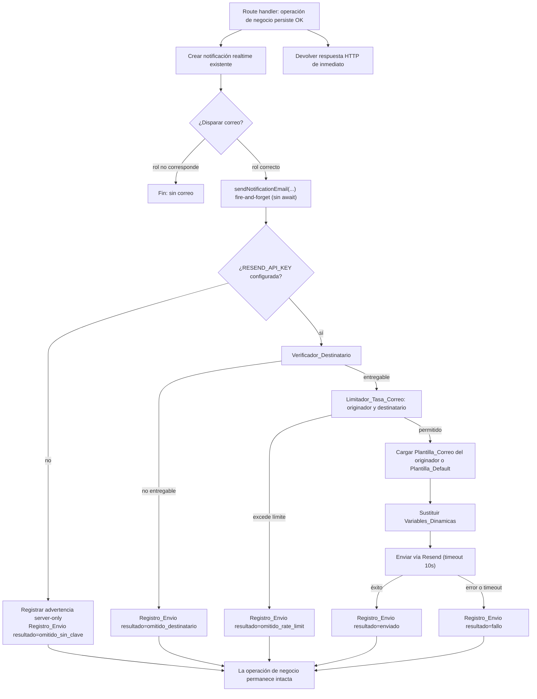

# Documento de Diseño

## Overview

Esta funcionalidad añade envío de correo electrónico transaccional mediante **Resend** como complemento de las notificaciones realtime existentes, sin reemplazarlas. El diseño es **genérico y multitenant**: cada tenant es un despliegue independiente que se activa proveyendo únicamente la variable de entorno `RESEND_API_KEY`, sin cambios de código (Requisito 12, 14).

El núcleo de la funcionalidad es un módulo del lado del servidor `lib/email/` que encapsula:

- La construcción y el envío de correos a través de Resend, con **degradación silenciosa** cuando la clave no está configurada (Requisito 1).
- La **verificación del destinatario** para descartar correos de marca del tenant y direcciones inválidas (Requisito 2).
- **Plantillas por defecto** completas, bilingües (es/en), por tipo de notificación (Requisito 3).
- Un **motor de sustitución de variables dinámicas** (Requisito 8, 9).
- Un **limitador de tasa** que reutiliza la infraestructura Upstash Redis existente (Requisito 16).
- El **registro en base de datos** de cada intento de envío (Requisito 10).

El envío se integra en los tres puntos de disparo donde hoy se crean notificaciones: cambio de asistencia a clase singular (Requisito 4), asignación de programa (Requisito 5) y solicitud de cambio de horario (Requisito 15). En todos los casos el envío es **asíncrono y no bloqueante**: la respuesta de la operación originaria se devuelve sin esperar al correo, y un fallo de correo nunca revierte la operación de negocio ni impide la notificación realtime.

Los profesores y administradores pueden personalizar el asunto y el cuerpo de los correos asociados a cada tipo de notificación mediante un **editor de plantillas** accesible desde la página de perfil, condicionado a que Resend esté disponible para el tenant (Requisito 6, 7).

### Decisión de diseño clave: trigger SQL vs. envío en el route handler

Hoy, la notificación al profesor por un cambio de asistencia la crea un **trigger de base de datos** (`create_notification_on_asistencia_change`). Un trigger SQL **no puede invocar a Resend** (servicio HTTP externo). Por tanto, el diseño **no modifica el trigger** (la notificación realtime se mantiene intacta, Requisito 4.7) y añade el **envío de correo en el route handler `PATCH /api/asistencia/[id]`** tras persistir el cambio, de forma coherente con las notificaciones explícitas de los otros dos puntos de disparo. Esto mantiene una sola fuente de verdad para el correo (el route), evita duplicación (Requisito 16.8) y permite usar Resend, plantillas y límites de tasa en TypeScript.

## Architecture

### Posición en la arquitectura existente

```
app/api/**/route.ts (puntos de disparo)
        │  (await operación de negocio + notificación realtime)
        │  (fire-and-forget, sin await del resultado)
        ▼
lib/email/  ── servicio de correo (solo servidor)
        │
        ├── resendClient.ts      → cliente Resend perezoso (lee RESEND_API_KEY)
        ├── emailService.ts      → orquestador: verifica, limita, construye, envía, registra
        ├── recipientVerifier.ts → Verificador_Destinatario (emailDomain del tenant)
        ├── templates/           → Plantillas_Default por tipo + idioma
        ├── variables.ts         → motor de sustitución de Variables_Dinamicas
        ├── emailRateLimit.ts    → Limitador_Tasa_Correo (reutiliza Upstash)
        └── types.ts             → tipos compartidos (TipoCorreo, ResultadoEnvio, etc.)
        │
        ▼
Resend API (externo)      Supabase (tabla email_envios, email_plantillas)
```

### Flujo de envío de un correo



### Principios de la arquitectura

1. **Solo servidor**: todo `lib/email/` se ejecuta exclusivamente en el servidor. `RESEND_API_KEY` y `SUPABASE_SERVICE_ROLE_KEY` nunca se exponen al cliente (Requisito 1.1, 1.2).
2. **No bloqueante**: los route handlers invocan al servicio de correo sin `await` sobre el resultado del envío (`void sendNotificationEmail(...)` con `.catch()` defensivo). La respuesta HTTP no espera a Resend (Requisito 4.4, 15.2).
3. **Degradación en cascada**: ausencia de clave → no-op; destinatario no entregable → omitir; límite excedido → omitir; cada nivel registra su motivo y nunca lanza hacia el route (Requisito 1.5, 2.6, 16.4).
4. **Genérico por tenant**: la disponibilidad y el dominio de marca se derivan de `process.env.RESEND_API_KEY` y `tenantConfig.emailDomain`, sin identificadores de tenant codificados (Requisito 12.1, 12.3).
5. **Idempotencia de evento**: cada disparo corresponde a un único evento de negocio y produce, como máximo, un correo por destinatario (Requisito 16.8).

## Components and Interfaces

### 1. `lib/email/types.ts` — Tipos compartidos

```typescript
import type { TipoNotificacion } from '@/lib/supabase/types';

/** Tipos de correo soportados — subconjunto de TipoNotificacion (Requisito 3.1). */
export type TipoCorreo =
  | 'confirmacion'
  | 'cancelacion'
  | 'solicitud_cambio_horario'
  | 'programa_asignado';

/** Resultado del intento de envío, persistido en email_envios (Requisito 10.2). */
export type ResultadoEnvio =
  | 'enviado'
  | 'fallo'
  | 'omitido_sin_clave'
  | 'omitido_destinatario'
  | 'omitido_rate_limit';

/** Idiomas soportados por las plantillas (Requisito 3.5, 3.6). */
export type IdiomaCorreo = 'es' | 'en';

/** Valores reales de las variables dinámicas para un evento (Requisito 8.4, 15.5). */
export interface VariablesCorreo {
  nombre_destinatario?: string;
  nombre_alumno?: string;
  titulo_clase?: string;
  fecha?: string;
  hora_inicio?: string;
  hora_fin?: string;
  enlace_clase?: string;
  // Específicas de solicitud_cambio_horario (Requisito 15.5):
  fecha_propuesta?: string;
  hora_inicio_propuesta?: string;
  hora_fin_propuesta?: string;
  nota_alumno?: string;
}

/** Petición de envío que recibe el servicio de correo. */
export interface SolicitudCorreo {
  tipo: TipoCorreo;
  originadorId: string;          // usuario que origina la notificación (Requisito 10.2)
  destinatarioId: string;        // profiles.id del destinatario
  destinatarioEmail: string;     // profiles.email del destinatario
  destinatarioIdioma: string | null;
  variables: VariablesCorreo;
  horarioId?: string | null;     // clase asociada, si existe (Requisito 10.2, 9.4)
  /** Identificador único del evento de negocio para prevenir duplicados (Requisito 16.8). */
  eventoId: string;
}

/** Contenido de una plantilla (default o personalizada). */
export interface ContenidoPlantilla {
  asunto: string;
  cuerpoHtml: string;
}
```

### 2. `lib/email/resendClient.ts` — Cliente Resend perezoso

Inicialización perezosa análoga a `rateLimit.ts`: el cliente solo se construye si la clave está presente y no vacía tras `trim()`. Expone también la señal de disponibilidad usada por la UI.

```typescript
import { Resend } from 'resend';

let resend: Resend | null = null;

function getApiKey(): string | null {
  const raw = process.env.RESEND_API_KEY;
  if (!raw) return null;
  const key = raw.trim();              // Requisito 1.5: vacío o solo espacios → null
  return key.length > 0 ? key : null;
}

/** True si el envío de correo está habilitado para el tenant activo (Requisito 12.1, 12.2). */
export function isEmailEnabled(): boolean {
  return getApiKey() !== null;
}

/** Devuelve el cliente Resend o null si no hay clave (degradación silenciosa, Requisito 1.5). */
export function getResendClient(): Resend | null {
  if (!isEmailEnabled()) return null;
  if (!resend) resend = new Resend(getApiKey()!);
  return resend;
}
```

- **Requisito 1.1–1.4**: la clave se lee solo de `process.env.RESEND_API_KEY`, sin prefijo `NEXT_PUBLIC_`, sin literales en código.
- **Requisito 1.8**: cuando se omite por ausencia de clave, `emailService` registra una advertencia server-only (`console.warn`).

### 3. `lib/email/recipientVerifier.ts` — Verificador de destinatario

```typescript
import { tenantConfig } from '@/config';

/** Resultado de la verificación (Requisito 2). */
export type VerificacionDestinatario =
  | { entregable: true }
  | { entregable: false; motivo: 'formato_invalido' | 'dominio_marca' };

/**
 * Determina si un correo es entregable (Requisito 2.1–2.5).
 * - Formato: exactamente un '@', parte local no vacía, dominio con al menos
 *   un punto separando dos etiquetas no vacías (Requisito 2.4).
 * - Dominio de marca: igual a emailDomain o termina en '.' + emailDomain,
 *   normalizado a minúsculas (Requisito 2.2, 2.3).
 */
export function verificarDestinatario(email: string | null | undefined): VerificacionDestinatario {
  if (!email) return { entregable: false, motivo: 'formato_invalido' };

  const partes = email.split('@');
  if (partes.length !== 2) return { entregable: false, motivo: 'formato_invalido' };
  const [local, dominioRaw] = partes;
  if (local.length === 0 || dominioRaw.length === 0) {
    return { entregable: false, motivo: 'formato_invalido' };
  }

  const etiquetas = dominioRaw.split('.');
  if (etiquetas.length < 2 || etiquetas.some((e) => e.length === 0)) {
    return { entregable: false, motivo: 'formato_invalido' };
  }

  const dominio = dominioRaw.toLowerCase();
  const marca = tenantConfig.emailDomain.toLowerCase();
  if (dominio === marca || dominio.endsWith(`.${marca}`)) {
    return { entregable: false, motivo: 'dominio_marca' };
  }

  return { entregable: true };
}
```

- **Requisito 12.3**: el dominio de marca proviene de `tenantConfig.emailDomain`.
- **Requisito 2.2**: el dominio es la porción tras el último `@`; al exigir exactamente un `@`, la "porción tras el último `@`" coincide con `partes[1]`.

### 4. `lib/email/templates/` — Plantillas por defecto

Una plantilla por tipo y por idioma. Estructura:

```
lib/email/templates/
  index.ts                 → getDefaultTemplate(tipo, idioma): ContenidoPlantilla
  confirmacion.ts
  cancelacion.ts
  solicitudCambioHorario.ts
  programaAsignado.ts
  layout.ts                → envoltorio HTML común (cabecera con tenantConfig.nombre, pie)
```

```typescript
// index.ts
import type { TipoCorreo, IdiomaCorreo, ContenidoPlantilla } from '../types';

/**
 * Devuelve la Plantilla_Default para un tipo e idioma (Requisito 3.1, 3.2).
 * Idioma no soportado o ausente → español (Requisito 3.5, 3.6).
 */
export function getDefaultTemplate(
  tipo: TipoCorreo,
  idioma: string | null | undefined,
): ContenidoPlantilla;

/** Normaliza el idioma del perfil a 'es' | 'en', con 'es' por defecto (Requisito 3.6). */
export function normalizarIdioma(idioma: string | null | undefined): IdiomaCorreo;
```

Cada plantilla:
- Incluye `{nombre_destinatario}`, una descripción del evento según su tipo y `tenantConfig.nombre` (Requisito 3.3).
- Produce asunto no vacío de 1–200 caracteres y cuerpo HTML no vacío (Requisito 3.4).
- El `from` se deriva del tenant (ver `emailService`, Requisito 3.7).

### 5. `lib/email/variables.ts` — Motor de sustitución de variables

```typescript
import type { TipoCorreo, VariablesCorreo } from './types';

/** Definición de una variable para el editor (Requisito 8.1). */
export interface DefinicionVariable {
  token: string;          // p.ej. '{hora_inicio}'
  claveDescripcion: string; // clave i18n de la descripción (Requisito 13)
}

/** Variables disponibles por tipo (Requisito 8.4, 15.5). */
export function variablesDisponibles(tipo: TipoCorreo): DefinicionVariable[];

/**
 * Sustituye cada token {variable} por su valor real (Requisito 8.3).
 * Tokens sin valor disponible → cadena vacía (Requisito 8.5, 9.4).
 * Tokens no presentes en la plantilla simplemente no se insertan (Requisito 9.3).
 */
export function sustituirVariables(plantilla: string, valores: VariablesCorreo): string;
```

La sustitución reemplaza **todas** las apariciones de cada token conocido. Las variables soportadas se mapean 1:1 con las claves de `VariablesCorreo`. Un token cuyo valor sea `undefined` o `null` se reemplaza por `''` (Requisito 8.5).

`enlace_clase` se construye en el punto de disparo con `NEXT_PUBLIC_APP_URL` como base (Requisito 9.1); si el evento no referencia una clase con id, el valor es `''` (Requisito 9.4).

### 6. `lib/email/emailRateLimit.ts` — Limitador de tasa de correo

Reutiliza el patrón exacto de `lib/utils/rateLimit.ts`: crea el limiter solo si `UPSTASH_REDIS_REST_URL`/`UPSTASH_REDIS_REST_TOKEN` están configurados y la URL empieza con `https://`; en caso contrario degrada a no-op (`allowed: true`).

```typescript
import { Ratelimit } from '@upstash/ratelimit';
import { Redis } from '@upstash/redis';
import type { RateLimitResult } from '@/lib/utils/rateLimit';

let emailLimiter: Ratelimit | null = null;
// ...inicialización condicional idéntica a rateLimit.ts, prefix 'rl:email'...

/** Límite por usuario originador (Requisito 16.2). Clave: `orig:{originadorId}`. */
export async function checkEmailRateLimitOriginador(originadorId: string): Promise<RateLimitResult>;

/** Límite por destinatario (Requisito 16.3). Clave: `dest:{emailNormalizado}`. */
export async function checkEmailRateLimitDestinatario(email: string): Promise<RateLimitResult>;
```

- **Requisito 16.5**: sin Redis, ambas funciones devuelven `allowed: true` (no-op).
- **Requisito 16.6**: las claves usan prefijos `orig:` y `dest:` con el identificador, aislando los conteos entre usuarios y destinatarios.
- **Requisito 16.1**: el servicio evalúa ambos límites antes de invocar a Resend; si cualquiera excede, omite y registra `omitido_rate_limit` (Requisito 16.2, 16.3, 16.4).
- Configuración propuesta: ventana deslizante con límites por separado para originador (p. ej. `Ratelimit.slidingWindow(20, '1 h')`) y destinatario (p. ej. `Ratelimit.slidingWindow(10, '1 h')`), ajustables.

### 7. `lib/email/emailService.ts` — Orquestador

Función pública única que los route handlers invocan de forma no bloqueante:

```typescript
import type { SolicitudCorreo, ResultadoEnvio } from './types';

/**
 * Orquesta el envío completo de un correo de notificación (Requisitos 1–10, 15, 16).
 * NUNCA lanza: cualquier error interno se captura y se traduce a un Registro_Envio
 * con resultado 'fallo' (Requisito 4.6, 5.4, 15.6). Devuelve el resultado para tests.
 */
export async function sendNotificationEmail(solicitud: SolicitudCorreo): Promise<ResultadoEnvio>;
```

Secuencia interna (corresponde al diagrama):

1. **Deduplicación de evento** (Requisito 16.8): consulta `email_envios` por `(evento_id, destinatario_id)`; si ya existe un registro con resultado `enviado` para ese evento+destinatario, retorna sin reenviar. La inserción del registro usa una restricción única para garantizar atomicidad.
2. **Disponibilidad** (Requisito 1.5, 1.8): si `!isEmailEnabled()`, `console.warn` server-only + `registrarEnvio('omitido_sin_clave')`; retorna.
3. **Verificación** (Requisito 2): `verificarDestinatario(email)`; si no entregable, `registrarEnvio('omitido_destinatario')`; retorna.
4. **Límite de tasa** (Requisito 16.1–16.4): evalúa originador y destinatario; si excede, `registrarEnvio('omitido_rate_limit')`; retorna.
5. **Construcción** (Requisito 3, 5.2, 7.3, 15.3): carga `email_plantillas` del `originadorId` para el `tipo`; si existe, usa esa; si no, `getDefaultTemplate(tipo, idioma)`. Aplica `sustituirVariables`. Deriva `from` del tenant (`no-reply@{tenantConfig.emailDomain}` o un valor derivable; ver Manejo de Errores).
6. **Envío** (Requisito 4.5): `getResendClient().emails.send(...)` con `Promise.race` contra un timeout de 10 s.
7. **Registro** (Requisito 10.1, 10.2): `registrarEnvio('enviado' | 'fallo')` según el resultado.

El registro se persiste con `createAdminClient()` (bypass RLS) para poder escribir el destinatario/originador y leer datos de terceros de forma controlada en servidor.

### 8. Integración en los puntos de disparo

**8.1 `PATCH /api/asistencia/[id]/route.ts`** (Requisito 4)
- Tras persistir el cambio y solo cuando `userRol === 'alumno'` y `estado ∈ {confirmado, cancelado}` (Requisito 4.1–4.3), construir `SolicitudCorreo` con `tipo` = `confirmacion`/`cancelacion`, `originadorId` = alumno, `destinatarioId` = `horario.profesor_id`.
- Cargar email/idioma del profesor con `createAdminClient()` (el alumno no puede leer el perfil del profesor por RLS).
- `eventoId` = `asistencia:{id}:{estado}` (estable por evento, Requisito 16.8).
- `enlace_clase` = `${NEXT_PUBLIC_APP_URL}/horarios/{horario_id}` (Requisito 9.1).
- Disparo no bloqueante: `void sendNotificationEmail(...).catch(() => {})`. La notificación realtime sigue siendo creada por el trigger DB (Requisito 4.7); no se modifica.

**8.2 `POST /api/programas/[id]/asignar/route.ts`** (Requisito 5)
- Dentro del loop por alumno, tras crear notificación realtime, disparar correo `programa_asignado` con `originadorId` = `user.id` (profesor/admin), `destinatarioId` = `alumno_id`.
- Cada alumno se evalúa de forma independiente (Requisito 5.6): el disparo va dentro del `try` por alumno y nunca interrumpe el loop.
- `eventoId` = `asignacion:{programaId}:{alumno_id}`.

**8.3 `POST /api/solicitudes-cambio/route.ts`** (Requisito 15)
- Tras crear la solicitud y la notificación realtime, disparar correo `solicitud_cambio_horario` con `originadorId` = `user.id` (alumno), `destinatarioId` = `profesorId`.
- Variables extra: `fecha_propuesta`, `hora_inicio_propuesta`, `hora_fin_propuesta`, `nota_alumno` (Requisito 15.5).
- Plantilla del profesor propietario si existe; si no, default (Requisito 15.3, 15.4). **Nota**: la plantilla personalizada se busca por el `originadorId`; en este flujo el originador es el alumno, pero el Requisito 15.3 exige la plantilla del **profesor propietario**. Por tanto, para este tipo la plantilla se carga por `profesorId` (destinatario), no por el originador. El servicio acepta un campo opcional `plantillaOwnerId` que, cuando se provee, anula `originadorId` para la selección de plantilla.
- `eventoId` = `solicitud:{solicitud.id}`.

### 9. API routes del editor de plantillas

**`GET /api/email/disponibilidad`** o, alternativamente, exponer un flag en `GET /api/perfil` (preferido para evitar un round-trip extra).
- Decisión: añadir `email_disponible: boolean` a la respuesta de `GET /api/perfil`, calculado server-side con `isEmailEnabled()` (Requisito 6.2, 6.3). Como `RESEND_API_KEY` es server-only, este es el canal para que el cliente conozca la disponibilidad sin exponer la clave.

**`GET /api/email/plantillas`** (Requisito 7.1)
- Auth requerida; rol profesor/admin (Requisito 16.7). Devuelve las plantillas del usuario por tipo, fusionadas con los defaults (para mostrar el contenido base cuando no hay personalización).

**`PUT /api/email/plantillas/[tipo]`** (Requisito 7.2, 7.6)
- Auth + rol. Valida con Zod: `asunto` no vacío (1–200), `cuerpoHtml` no vacío (Requisito 7.6).
- Restricción de rol alumno: rechaza tipos no permitidos al rol; en particular ningún `alumno` puede crear/editar plantillas, y específicamente se impide `confirmacion`, `cancelacion` (Requisito 7.4) y `solicitud_cambio_horario` (Requisito 15.8). Como solo profesor/admin acceden al editor, el rol alumno se deniega de plano (Requisito 6.5).
- Persiste por `(user_id, tipo)` con upsert (Requisito 7.2, 7.3).

**`DELETE /api/email/plantillas/[tipo]`** (Requisito 7.5)
- Elimina la fila personalizada → el sistema vuelve a aplicar la `Plantilla_Default` (reset).

Todas las rutas siguen el patrón del proyecto: `createClient()` → `auth.getUser()` → fetch `profiles.rol` → checks → operación → `NextResponse.json` (Requisito 16.7).

### 10. UI del editor de plantillas

- **Botón de acceso** en la sección "Configuración de clases" de `app/(dashboard)/perfil/page.tsx` (visible solo `isProfesorOrAdmin`), condicionado a `perfilData.email_disponible === true` (Requisito 6.1–6.3).
- **Editor** en `app/(dashboard)/perfil/plantillas-correo/page.tsx` (client component): selector de tipo, campos de asunto y cuerpo (reutilizando `inputCls`, `SectionTitle`, `Field`, `SaveBar`), panel lateral con la lista de `variablesDisponibles(tipo)` y su descripción; al hacer clic en una variable se inserta su token en el campo activo (Requisito 8.1, 8.2). Botón "Restablecer" (Requisito 7.5). Validación de vacíos con toast (Requisito 7.6).
- Guard de ruta: si el usuario es alumno o `email_disponible` es false, redirigir/denegar (Requisito 6.4, 6.5).
- Todos los textos vía nuevo namespace `plantillasCorreo` en `messages/es.json` y `messages/en.json` (Requisito 13.1–13.3).

## Data Models

### Nueva tabla `email_plantillas` (Requisito 7)

| Columna      | Tipo          | Notas |
|--------------|---------------|-------|
| `id`         | uuid PK       | `DEFAULT uuid_generate_v4()` |
| `user_id`    | uuid NOT NULL | FK → `profiles(id)` ON DELETE CASCADE (Requisito 7.2) |
| `tipo`       | tipo_notificacion NOT NULL | tipo de correo personalizado |
| `asunto`     | text NOT NULL | CHECK longitud 1–200 (Requisito 7.6, 3.4) |
| `cuerpo_html`| text NOT NULL | CHECK no vacío (Requisito 7.6) |
| `created_at` | timestamptz NOT NULL DEFAULT now() | |
| `updated_at` | timestamptz NOT NULL DEFAULT now() | trigger `update_updated_at` |

- **Restricción única** `(user_id, tipo)`: una plantilla por usuario y tipo (Requisito 7.2).
- Índice `idx_email_plantillas_user` en `user_id`.

**RLS** (patrón `get_user_rol()`):
- profesor/admin: SELECT/INSERT/UPDATE/DELETE de filas propias (`user_id = auth.uid()`).
- alumno: sin políticas → sin acceso (Requisito 6.5, 7.4, 15.8).

### Nueva tabla `email_envios` — Registro de envíos (Requisito 10)

| Columna          | Tipo          | Notas |
|------------------|---------------|-------|
| `id`             | uuid PK       | `DEFAULT uuid_generate_v4()` |
| `originador_id`  | uuid NOT NULL | FK → `profiles(id)` ON DELETE CASCADE (Requisito 10.2) |
| `destinatario_id`| uuid NOT NULL | FK → `profiles(id)` ON DELETE CASCADE |
| `tipo`           | tipo_notificacion NOT NULL | (Requisito 10.2) |
| `resultado`      | text NOT NULL | CHECK ∈ {`enviado`,`fallo`,`omitido_sin_clave`,`omitido_destinatario`,`omitido_rate_limit`} (Requisito 10.2, 10.3, 16.4) |
| `motivo`         | text          | detalle de omisión/fallo (Requisito 10.3) |
| `horario_id`     | uuid          | FK → `horarios(id)` ON DELETE SET NULL, clase asociada (Requisito 10.2, 10.4) |
| `evento_id`      | text NOT NULL | identificador del evento de negocio (Requisito 16.8) |
| `created_at`     | timestamptz NOT NULL DEFAULT now() | marca de tiempo del intento (Requisito 10.2) |

- **Restricción única parcial** `UNIQUE (evento_id, destinatario_id) WHERE resultado = 'enviado'`: garantiza no más de un envío exitoso por evento y destinatario (Requisito 16.8).
- Índice `idx_email_envios_horario` en `horario_id` para el conteo por clase (Requisito 10.4).
- Índices `idx_email_envios_originador`, `idx_email_envios_destinatario`.

**RLS**:
- admin: SELECT de todas las filas.
- profesor: SELECT de filas donde `originador_id = auth.uid()` o `destinatario_id = auth.uid()`.
- alumno: SELECT solo de filas donde `destinatario_id = auth.uid()` o `originador_id = auth.uid()` — **nunca** de otros usuarios (Requisito 10.5).
- INSERT lo realiza el servidor con `createAdminClient()` (bypass RLS); no se requiere política de INSERT para roles.

### Migración (Requisito 11)

- Archivo `supabase/migrations/053_email_notifications.sql` (siguiente a la 052 existente; numeración verificada).
- **Idempotente** (Requisito 11.2): `CREATE TABLE IF NOT EXISTS`, `CREATE INDEX IF NOT EXISTS`, creación de políticas envuelta en `DO $$ BEGIN IF NOT EXISTS (SELECT 1 FROM pg_policies WHERE policyname = ...) THEN CREATE POLICY ...; END IF; END $$;`, y restricciones únicas con guarda `IF NOT EXISTS`.
- No se altera el enum `tipo_notificacion` (los cuatro tipos ya existen).
- Aplicación vía `mcp_supabase_apply_migration`.

### Actualización manual de `lib/supabase/types.ts` (Requisito 11.3, 11.4)

- Añadir `email_plantillas` y `email_envios` a `Database['public']['Tables']` (Row/Insert/Update/Relationships) manualmente.
- Añadir alias exportados: `export type EmailPlantilla = Tables<'email_plantillas'>;` y `export type EmailEnvio = Tables<'email_envios'>;`.
- **No** usar generación automática de tipos (Requisito 11.4): rompe la app.

## Correctness Properties

*Una propiedad es una característica o comportamiento que debe cumplirse en todas las ejecuciones válidas de un sistema; esencialmente, una afirmación formal sobre lo que el sistema debe hacer. Las propiedades sirven de puente entre las especificaciones legibles por humanos y las garantías de correctitud verificables por máquina.*

Las siguientes propiedades se derivan del análisis previo (prework) de los criterios de aceptación, tras eliminar redundancias. Cada una se implementará con un único test basado en propiedades (mínimo 100 iteraciones).

### Property 1: Verificación de destinatario

*Para todo* correo de destinatario, el Verificador_Destinatario lo clasifica como entregable si y solo si tiene formato válido (exactamente un `@`, parte local no vacía, y un dominio con al menos un punto separando dos etiquetas no vacías) y su dominio, normalizado a minúsculas, no es igual al `tenantConfig.emailDomain` ni termina en `.` seguido de ese dominio; la decisión es invariante ante cambios de mayúsculas/minúsculas en el dominio.

**Validates: Requirements 2.1, 2.2, 2.3, 2.4, 2.5, 12.3**

### Property 2: Disponibilidad y degradación por clave

*Para toda* cadena que esté ausente, vacía o compuesta únicamente por espacios en blanco como valor de `RESEND_API_KEY`, `isEmailEnabled()` es `false` y `sendNotificationEmail` omite el envío sin lanzar excepción y con resultado `omitido_sin_clave`; y *para toda* cadena no vacía tras `trim()`, `isEmailEnabled()` es `true`, sin depender de ningún identificador de tenant.

**Validates: Requirements 1.5, 12.1, 12.2, 14.3, 14.4**

### Property 3: Validez de las plantillas por defecto

*Para todo* par (tipo de correo soportado, idioma) la Plantilla_Default existe y produce un asunto no vacío de entre 1 y 200 caracteres y un cuerpo HTML no vacío; además, `normalizarIdioma` devuelve `'es'` o `'en'` cuando el idioma es soportado y `'es'` para cualquier otro valor (incluido ausente o no soportado).

**Validates: Requirements 3.1, 3.4, 3.5, 3.6**

### Property 4: Contenido de la plantilla por defecto

*Para todo* tipo de correo soportado, cuando se construye la Plantilla_Default con un nombre de destinatario provisto, el cuerpo renderizado contiene el nombre del destinatario y el nombre del tenant (`tenantConfig.nombre`).

**Validates: Requirements 3.3**

### Property 5: Selección de plantilla personalizada o por defecto, aislada por propietario

*Para todo* tipo de correo y todo par de usuarios distintos, la construcción del correo usa la Plantilla_Correo personalizada del propietario indicado (originador, o profesor propietario en `solicitud_cambio_horario`) cuando esta existe, y la Plantilla_Default en caso contrario; la plantilla personalizada de un usuario nunca se aplica a correos cuyo propietario es otro usuario.

**Validates: Requirements 3.2, 5.2, 5.3, 7.3, 7.5, 15.3, 15.4**

### Property 6: Round-trip de persistencia de plantillas

*Para todo* contenido de plantilla válido (asunto de 1–200 caracteres no vacío y cuerpo no vacío), guardarlo para un `(user_id, tipo)` y volverlo a leer devuelve exactamente el mismo asunto y cuerpo.

**Validates: Requirements 7.2**

### Property 7: Validación de asunto y cuerpo vacíos

*Para toda* entrada de plantilla cuyo asunto sea vacío o compuesto solo por espacios, o cuyo cuerpo sea vacío o compuesto solo por espacios, el guardado se rechaza; y *para toda* entrada con asunto de 1–200 caracteres no vacío y cuerpo no vacío, el guardado se acepta.

**Validates: Requirements 7.6**

### Property 8: Cobertura de variables dinámicas por tipo

*Para todo* tipo de correo soportado, `variablesDisponibles(tipo)` incluye al menos el nombre del destinatario, el nombre del alumno, el título de la clase, la fecha, `{hora_inicio}`, `{hora_fin}` y `{enlace_clase}`, cada una con una descripción no vacía; y para el tipo `solicitud_cambio_horario` incluye además la fecha propuesta, la hora de inicio propuesta, la hora de fin propuesta y la nota del alumno.

**Validates: Requirements 8.1, 8.4, 15.5**

### Property 9: Sustitución de variables dinámicas

*Para toda* plantilla y todo conjunto de valores, tras `sustituirVariables` no permanece ningún token de variable conocida en el resultado: cada token cuyo valor está disponible se reemplaza por ese valor, y cada token sin valor disponible se reemplaza por la cadena vacía; los tokens que no aparecen en la plantilla no se introducen.

**Validates: Requirements 8.3, 8.5, 9.2, 9.3, 9.4**

### Property 10: Construcción del enlace de clase

*Para todo* identificador de clase, el Enlace_Clase generado comienza con el valor de `NEXT_PUBLIC_APP_URL` y contiene ese identificador.

**Validates: Requirements 9.1**

### Property 11: Registro completo por intento de envío

*Para toda* solicitud de correo que no sea un duplicado de evento, el servicio crea exactamente un Registro_Envio cuyo `resultado` pertenece al conjunto {`enviado`, `fallo`, `omitido_sin_clave`, `omitido_destinatario`, `omitido_rate_limit`} y que incluye el identificador del originador, el del destinatario, el tipo, la marca de tiempo, el identificador de clase cuando se provee, y un motivo cuando el resultado es de omisión o fallo.

**Validates: Requirements 10.1, 10.2, 10.3, 16.4**

### Property 12: Manejo de error y timeout de envío

*Para toda* respuesta del proveedor que sea un error o que no finalice dentro de los 10 segundos, el resultado del envío registrado es `fallo` y el servicio no lanza excepción hacia el llamador.

**Validates: Requirements 4.5**

### Property 13: Independencia por alumno en asignación múltiple

*Para toda* lista de alumnos destinatarios y toda combinación de resultados de correo (éxito, fallo u omisión) por alumno, se evalúa y prepara el envío de forma independiente para cada alumno, de modo que la omisión o el fallo del correo de un alumno no impide el procesamiento del correo de los alumnos restantes.

**Validates: Requirements 5.6**

### Property 14: Control de tasa por originador y por destinatario

*Para toda* secuencia de envíos, una vez que el número de correos originados por un mismo usuario originador (o dirigidos a un mismo destinatario) alcanza el límite configurado dentro de la ventana, los envíos adicionales de ese originador (o a ese destinatario) durante la ventana se omiten con resultado `omitido_rate_limit` y sin invocar a Resend.

**Validates: Requirements 16.1, 16.2, 16.3, 16.4**

### Property 15: Degradación no-op del limitador sin Redis

*Para toda* cantidad de comprobaciones y todo identificador, cuando `UPSTASH_REDIS_REST_URL` y `UPSTASH_REDIS_REST_TOKEN` no están configurados, el Limitador_Tasa_Correo devuelve siempre `allowed: true` y no bloquea ningún envío.

**Validates: Requirements 16.5**

### Property 16: Aislamiento de conteos del limitador

*Para todo* par de identificadores distintos, el consumo del presupuesto de límite de tasa de uno no altera la decisión de límite de tasa del otro.

**Validates: Requirements 16.6**

### Property 17: Idempotencia de evento (sin duplicados)

*Para todo* conjunto de invocaciones del servicio con el mismo identificador de evento y el mismo destinatario, se produce a lo sumo un envío exitoso (`enviado`); las invocaciones restantes se deduplican y no generan correos adicionales al mismo destinatario.

**Validates: Requirements 16.8**

## Error Handling

El principio rector es **el envío de correo nunca degrada la operación de negocio**. Estrategias por capa:

1. **Degradación silenciosa por ausencia de clave** (Requisito 1.5–1.8): `isEmailEnabled()` devuelve `false`; el servicio registra una advertencia server-only (`console.warn`) una vez por intento y crea un Registro_Envio `omitido_sin_clave`. No se lanza ninguna excepción y la operación originaria conserva todos sus cambios.

2. **Invocación no bloqueante** (Requisito 4.4, 15.2): los route handlers llaman `void sendNotificationEmail(...).catch(() => {})` sin `await`. La respuesta HTTP de la operación de negocio se devuelve de inmediato. Como Vercel puede terminar funciones serverless tras enviar la respuesta, el envío se inicia antes de retornar y se confía en el ciclo de vida del request; si se requiere mayor garantía se documenta el uso de `waitUntil` (de `@vercel/functions`) como punto de extensión, sin bloquear la respuesta.

3. **Timeout de envío** (Requisito 4.5): `Promise.race([resend.emails.send(...), timeout(10_000)])`. Si vence el timeout o Resend devuelve error, se captura y se registra `fallo`. Nunca se propaga al route.

4. **Sin rollback** (Requisito 1.7, 4.6, 5.4, 15.6): toda la lógica de correo vive después de que la operación de negocio se haya persistido. Un fallo de correo no ejecuta ninguna reversión.

5. **No interferencia con realtime** (Requisito 1.6, 4.7, 5.5, 15.7): la creación de notificaciones (trigger DB o inserción explícita) ocurre con independencia del correo y antes del disparo del correo.

6. **Aislamiento por destinatario en lotes** (Requisito 5.6): en la asignación múltiple, cada disparo de correo va dentro del bloque `try` por alumno con su propio `.catch()`, de modo que un error no interrumpe el loop.

7. **Errores del servicio capturados internamente**: `sendNotificationEmail` nunca lanza; cualquier excepción inesperada (incluida la de escritura del Registro_Envio con `createAdminClient()`) se captura y, en lo posible, se traduce a un Registro_Envio `fallo`. Si incluso el registro falla, se hace `console.error` server-only.

8. **Dirección `from` inválida**: si el `from` derivado del tenant es rechazado por Resend, se trata como un fallo de envío normal (Registro_Envio `fallo`).

## Testing Strategy

Enfoque dual: **tests basados en propiedades** para la lógica universal y **tests de ejemplo/integración** para escenarios concretos, autorización, UI y wiring.

### Librería de property-based testing

- **fast-check** (estándar de facto para TypeScript) ejecutado con **Vitest** (o el runner ya configurado en el proyecto; si no existe, se configura Vitest).
- Cada test de propiedad corre **mínimo 100 iteraciones** (`fc.assert(fc.property(...), { numRuns: 100 })`).
- Cada test de propiedad se etiqueta con un comentario que referencia la propiedad del diseño:
  `// Feature: email-notifications-resend, Property {N}: {texto de la propiedad}`
- No se implementa property-based testing desde cero; se usa la librería.

### Mapa de propiedades a módulos bajo prueba

| Propiedad | Módulo / función | Notas de generadores |
|-----------|------------------|----------------------|
| P1 | `recipientVerifier.verificarDestinatario` | emails válidos/ inválidos, dominios de marca y subdominios, variación de mayúsculas |
| P2 | `resendClient.isEmailEnabled`, `emailService` | cadenas de whitespace/vacías vs. no vacías (mock `process.env`) |
| P3 | `templates/index.getDefaultTemplate`, `normalizarIdioma` | producto (tipo × idioma), idiomas arbitrarios |
| P4 | `templates` + `variables.sustituirVariables` | nombres y datos aleatorios |
| P5 | `emailService` (selección de plantilla) | dos usuarios, con/sin plantilla, `plantillaOwnerId` |
| P6 | API plantillas (PUT/GET) o capa de repositorio | asunto 1–200, cuerpo no vacío |
| P7 | validación Zod de plantillas | asunto/cuerpo vacíos o whitespace |
| P8 | `variables.variablesDisponibles` | todos los tipos |
| P9 | `variables.sustituirVariables` | plantillas con tokens, valores parciales/ausentes |
| P10 | construcción de `enlace_clase` | ids aleatorios, base configurable |
| P11 | `emailService` con mocks (Resend, admin client) | todos los caminos de resultado |
| P12 | `emailService` con Resend mock (error / lento) | timers falsos para el timeout de 10 s |
| P13 | lógica del loop de asignación (extraída a función testeable) | listas de alumnos, resultados mezclados |
| P14 | `emailRateLimit` con limiter determinista | secuencias por originador/destinatario |
| P15 | `emailRateLimit` sin env de Upstash | cualquier id y volumen |
| P16 | `emailRateLimit` con limiter determinista | ids distintos |
| P17 | `emailService` con repositorio de envíos en memoria/mock | mismas (eventoId, destinatarioId) repetidas |

### Tests de ejemplo y de integración

- **Routes** (`asistencia/[id]`, `programas/[id]/asignar`, `solicitudes-cambio`): que el correo se dispara con el tipo y destinatario correctos solo cuando corresponde al rol (Requisitos 4.1–4.3, 5.1, 15.1); que la respuesta no espera al correo (4.4, 15.2); que un fallo/omisión de correo no revierte la operación ni impide la notificación realtime (1.6, 1.7, 4.6, 4.7, 5.4, 5.5, 15.6, 15.7).
- **Autorización** del editor de plantillas: alumno → 401/403; tipos restringidos por rol (Requisitos 6.5, 7.4, 15.8, 16.7).
- **Disponibilidad en UI**: render del perfil con `email_disponible` true/false y rol (Requisitos 6.1–6.4); inserción de variables en el campo activo (8.2).
- **RLS**: cliente de alumno solo lee sus propios Registros_Envio (Requisito 10.5); conteo por clase (10.4).
- **i18n**: paridad de claves del namespace `plantillasCorreo` entre `es.json` y `en.json` (Requisitos 13.1–13.3).
- **Migración idempotente**: aplicar la migración 053 dos veces sin error (Requisito 11.2).
- **Smoke/configuración**: `.env.example` contiene `RESEND_API_KEY` con placeholder (1.3); `.env.tenant.pregunta-estrategica` contiene la clave (14.1); `types.ts` incluye las nuevas tablas y compila (11.3).

### Balance de tests

- Los tests de propiedad cubren la lógica pura (verificación, sustitución, plantillas, límite de tasa, idempotencia, registro).
- Los tests de ejemplo se limitan a escenarios concretos, autorización, UI y wiring, evitando duplicar lo que ya cubren las propiedades.
- Los efectos externos (Resend, Supabase admin, Upstash) se mockean en los tests de propiedad para mantener el costo bajo y permitir 100+ iteraciones; los tests de integración usan 1–3 ejemplos representativos.

## Ampliación: Requisitos 17–19

Esta sección extiende el diseño ya aprobado para cubrir tres incrementos sobre la funcionalidad de correo, sin alterar la arquitectura existente. Los tres reutilizan los componentes ya descritos (orquestador `sendNotificationEmail`, `recipientVerifier`, `variables`, `templates`, `emailRateLimit`, `email_envios`) y mantienen los principios de **no bloqueante**, **degradación en cascada**, **sin rollback** y **idempotencia de evento**.

Resumen de los tres incrementos:

- **Requisito 17** — Vista previa del cuerpo en el Editor_Plantillas (solo UI cliente).
- **Requisito 18** — Nuevo tipo de correo `nueva_clase`, disparado al crear una Clase_Singular (`POST /api/horarios`). No requiere migración: `nueva_clase` ya existe en el enum `tipo_notificacion`.
- **Requisito 19** — Nuevo tipo de correo `invitacion_acceso`, disparado al crear un usuario en las tres rutas de alta. Requiere una migración idempotente que añade el valor al enum.

### A. Requisito 17 — Vista previa del cuerpo (UI)

**Alcance**: cambio exclusivamente cliente en `app/(dashboard)/perfil/plantillas-correo/page.tsx`. No toca `lib/email/` ni el backend.

**Estado nuevo**:

```typescript
// Modo del campo de cuerpo en el editor (Requisito 17.1, 17.2).
const [modoCuerpo, setModoCuerpo] = useState<'editor' | 'preview'>('editor');
```

- El estado por defecto es `'editor'`, de modo que el editor **inicia siempre en Modo_Edicion** (Requisito 17.2).
- El contenido editado vive en el estado `cuerpoHtml` ya existente; `modoCuerpo` solo controla **qué se renderiza**, no el contenido. Por tanto, alternar entre modos **no descarta cambios** (Requisito 17.4): no hay ninguna mutación de `cuerpoHtml` en el handler del toggle.

**Control de alternancia** (encima del campo de cuerpo, junto al `<label>` del textarea `id="plantilla-cuerpo"`): dos botones tipo segmento ("Editar" / "Vista previa") que fijan `modoCuerpo`. El botón activo se resalta con las clases del proyecto; el inactivo queda secundario.

```tsx
{/* Toggle Modo_Edicion / Modo_Vista_Previa (Requisito 17.1, 17.5) */}
<div role="group" aria-label={t('cuerpo.modoLabel')}>
  <button type="button" aria-pressed={modoCuerpo === 'editor'}
          onClick={() => setModoCuerpo('editor')}>
    {t('cuerpo.modoEditor')}
  </button>
  <button type="button" aria-pressed={modoCuerpo === 'preview'}
          onClick={() => setModoCuerpo('preview')}>
    {t('cuerpo.modoPreview')}
  </button>
</div>

{modoCuerpo === 'editor' ? (
  <textarea id="plantilla-cuerpo" value={cuerpoHtml}
            onChange={(e) => setCuerpoHtml(e.target.value)} /* refs de inserción intactas */ />
) : (
  /* Modo_Vista_Previa: renderiza el HTML actual (Requisito 17.3) */
  <div className="email-preview"
       dangerouslySetInnerHTML={{ __html: cuerpoHtml }} />
)}
```

- En `'editor'` se renderiza el `textarea` actual (con su `id="plantilla-cuerpo"` y las refs usadas para insertar variables desde el panel lateral; el mecanismo de inserción del Requisito 8.2 permanece sin cambios y solo opera en Modo_Edicion).
- En `'preview'` se renderiza un contenedor con `dangerouslySetInnerHTML={{ __html: cuerpoHtml }}` que muestra **exactamente el mismo HTML que se enviará** (Requisito 17.3).

**Consideración de seguridad** (sobre `dangerouslySetInnerHTML`): el HTML proviene del propio Usuario_Editor (profesor/admin) y la vista previa se renderiza únicamente en **su** navegador, sobre el contenido que él mismo está escribiendo; no es contenido de terceros ni de usuarios no confiables, por lo que el riesgo de XSS reflejado/almacenado hacia otros usuarios no aplica en este punto. Se documenta explícitamente que el preview usa el mismo `cuerpoHtml` que viajará en el correo, de forma que lo que el editor ve es representativo del envío real. El cuerpo persistido sigue validándose en el backend (asunto 1–200 no vacío, cuerpo no vacío) por el `emailPlantillaSchema` ya existente; esta vista previa no cambia ese contrato.

**i18n** (Requisito 17.5): se añaden claves nuevas al namespace `plantillasCorreo` en `messages/es.json` y `messages/en.json`, por ejemplo bajo `plantillasCorreo.cuerpo`:

| Clave | es | en |
|-------|----|----|
| `plantillasCorreo.cuerpo.modoLabel` | "Modo de edición del cuerpo" | "Body editing mode" |
| `plantillasCorreo.cuerpo.modoEditor` | "Editar" | "Edit" |
| `plantillasCorreo.cuerpo.modoPreview` | "Vista previa" | "Preview" |

Ningún texto visible del control se codifica de forma literal en el componente (Requisito 13.3, 17.5).

### B. Requisito 18 — Correo `nueva_clase`

**Sin migración**: `nueva_clase` ya pertenece al enum `tipo_notificacion`, por lo que el `Extract` de `TipoCorreo` sigue siendo válido al añadir el literal. No se altera la base de datos para este requisito.

**B.1 `lib/email/types.ts` — ampliar `TipoCorreo`**

```typescript
export type TipoCorreo = Extract<
  TipoNotificacion,
  | 'confirmacion'
  | 'cancelacion'
  | 'solicitud_cambio_horario'
  | 'programa_asignado'
  | 'nueva_clase'        // Requisito 18
  | 'invitacion_acceso'  // Requisito 19 (ver sección C)
>;
```

`VariablesCorreo` **no requiere campos nuevos** para `nueva_clase`: este tipo usa exclusivamente las variables comunes (`nombre_destinatario`, `nombre_alumno`, `titulo_clase`, `fecha`, `hora_inicio`, `hora_fin`, `enlace_clase`), ya presentes en la interfaz (Requisito 18.9).

**B.2 `lib/email/templates/nuevaClase.ts` — Plantilla_Default**

Nuevo archivo siguiendo el patrón exacto de las cuatro plantillas existentes: exporta `plantilla: Record<IdiomaCorreo, ContenidoPlantilla>` con variantes `es`/`en`, construidas con `renderLayout` (cabecera con `tenantConfig.nombre`, pie). Está dirigida al **alumno** (`{nombre_destinatario}` = alumno) y describe la nueva clase con `{titulo_clase}`, `{fecha}`, `{hora_inicio}`, `{hora_fin}` y un botón/enlace `{enlace_clase}`. Produce asunto no vacío de 1–200 caracteres y cuerpo HTML no vacío en ambos idiomas (Requisito 18.4).

**B.3 Registro de la plantilla en `templates/index.ts`**

```typescript
import { plantilla as nuevaClase } from './nuevaClase';
// ...
const PLANTILLAS: Record<TipoCorreo, Record<IdiomaCorreo, ContenidoPlantilla>> = {
  confirmacion,
  cancelacion,
  solicitud_cambio_horario: solicitudCambioHorario,
  programa_asignado: programaAsignado,
  nueva_clase: nuevaClase,             // Requisito 18
  invitacion_acceso: invitacionAcceso, // Requisito 19 (ver sección C)
};
```

**B.4 `lib/email/variables.ts` — variables disponibles**

`nueva_clase` usa las `CLAVES_COMUNES` ya definidas (que incluyen `titulo_clase`, `fecha`, `hora_inicio`, `hora_fin`, `enlace_clase`, `nombre_destinatario`, `nombre_alumno`). `variablesDisponibles('nueva_clase')` devuelve las comunes; no se añaden claves nuevas (Requisito 18.9). El bloque condicional actual (`tipo === 'solicitud_cambio_horario' ? [...comunes, ...solicitud] : comunes`) ya resuelve `nueva_clase` a las comunes sin cambios adicionales.

**B.5 `lib/validations/emailPlantilla.schema.ts` — `TIPOS_CORREO`**

Se añade `'nueva_clase'` (y `'invitacion_acceso'`, sección C) al array `TIPOS_CORREO`, que pasa a tener **6 tipos**. Como `tipoCorreoSchema` deriva de ese array, el editor acepta y valida el nuevo tipo automáticamente (Requisito 18.10).

**B.6 Disparo en `POST /api/horarios/route.ts`** (Requisito 18.1, 18.6, 18.7, 18.8)

Tras insertar el horario y la fila de asistencia (operación de negocio persistida), se añade un disparo **fire-and-forget** no bloqueante, coherente con los otros puntos de disparo:

```typescript
// Tras persistir horario + asistencia. Requisito 18.1, 18.6.
void (async () => {
  const admin = createAdminClient();
  const { data: alumno } = await admin
    .from('profiles')
    .select('email, idioma, nombre, apellido')
    .eq('id', body.alumno_id)
    .single();
  if (!alumno) return;

  await sendNotificationEmail({
    tipo: 'nueva_clase',
    originadorId: profesorId,            // creador del horario (admin puede pasar body.profesor_id)
    destinatarioId: body.alumno_id,
    destinatarioEmail: alumno.email,
    destinatarioIdioma: alumno.idioma,
    variables: {
      nombre_destinatario: `${alumno.nombre} ${alumno.apellido}`.trim(),
      nombre_alumno: `${alumno.nombre} ${alumno.apellido}`.trim(),
      titulo_clase: horario.titulo,
      fecha: horario.fecha,
      hora_inicio: horario.hora_inicio,
      hora_fin: horario.hora_fin,
      enlace_clase: `${process.env.NEXT_PUBLIC_APP_URL}/horarios/${horario.id}`,
    },
    horarioId: horario.id,
    eventoId: `nueva_clase:${horario.id}`,
  });
})().catch(() => {});
```

- `originadorId` = `profesorId` (el creador del horario; cuando un admin crea para otro profesor vía `body.profesor_id`, ese es el originador). Al no pasar `plantillaOwnerId`, la selección de plantilla usa el originador, es decir, la Plantilla_Correo personalizada del creador si existe, o la Plantilla_Default (Requisito 18.2, 18.3) — mismo mecanismo de la Propiedad 5.
- `destinatarioId` = `body.alumno_id`; email/idioma/nombre del alumno se cargan con `createAdminClient()` (el route hoy solo exige usuario autenticado, y el servidor lee el perfil del alumno de forma controlada).
- `enlace_clase` = `${NEXT_PUBLIC_APP_URL}/horarios/${horario.id}` (Requisito 9.1).
- `eventoId` = `nueva_clase:${horario.id}` (estable por evento; idempotencia de la Propiedad 17).
- El Verificador_Destinatario (Requisito 18.5), el Limitador_Tasa_Correo (Requisito 18.8) y el Registro_Envio (Requisito 18.11) operan dentro de `sendNotificationEmail` sin cambios.
- La respuesta de creación del horario **no espera** al correo (Requisito 18.6); un fallo de correo no revierte el horario (Requisito 18.7).

### C. Requisito 19 — Correo `invitacion_acceso`

**C.1 Migración `supabase/migrations/054_invitacion_acceso_enum.sql`** (Requisito 19.9, 11.1, 11.2)

Como la 053 ya está usada, la siguiente es la **054**. La migración solo añade el valor al enum, de forma idempotente:

```sql
-- 054_invitacion_acceso_enum.sql
-- Añade 'invitacion_acceso' al enum tipo_notificacion (Requisito 19.9).
ALTER TYPE tipo_notificacion ADD VALUE IF NOT EXISTS 'invitacion_acceso';
```

> **Nota importante sobre transacciones**: `ALTER TYPE ... ADD VALUE` **no puede usarse en la misma transacción** en la que el nuevo valor se utiliza (Postgres no permite emplear un valor de enum recién añadido hasta que la transacción que lo crea haya hecho commit). Por eso esta migración hace **únicamente** el `ADD VALUE` y no inserta ni referencia el nuevo valor. El uso del valor (por la app y por filas de `email_envios`/`email_plantillas`) ocurre en ejecuciones posteriores. `IF NOT EXISTS` la hace idempotente y segura ante reejecución.

**C.2 Actualización manual de `lib/supabase/types.ts`** (Requisito 11.3, 11.4)

Añadir manualmente `'invitacion_acceso'` al union del enum `tipo_notificacion` en `Database['public']['Enums']` y al objeto `Constants` (lista de valores del enum). No se usa generación automática de tipos (Requisito 11.4). `nueva_clase` ya está presente en el enum y no requiere edición.

**C.3 `lib/email/types.ts` — `TipoCorreo` y `VariablesCorreo`**

`TipoCorreo` ya incluye `'invitacion_acceso'` (ver B.1). Se añaden a `VariablesCorreo` dos campos opcionales específicos de este tipo:

```typescript
export interface VariablesCorreo {
  // ...campos existentes...
  // Específicas de `invitacion_acceso` (Requisito 19.4):
  /** Enlace_Acceso absoluto `${NEXT_PUBLIC_APP_URL}/setup/${code}` (`{enlace_acceso}`). */
  enlace_acceso?: string;
  /** Correo con el que el usuario recién creado accederá (`{email_acceso}`). */
  email_acceso?: string;
}
```

**C.4 `lib/email/variables.ts` — claves de invitación**

Se añade una constante para las claves específicas y se enrutan en `variablesDisponibles`, además de incorporarlas a `CLAVES_CONOCIDAS` para que `sustituirVariables` las reemplace:

```typescript
// Claves específicas del tipo `invitacion_acceso` (Requisito 19.4).
const CLAVES_INVITACION = [
  'enlace_acceso',
  'email_acceso',
] as const satisfies readonly (keyof VariablesCorreo)[];

const CLAVES_CONOCIDAS = [
  ...CLAVES_COMUNES,
  ...CLAVES_SOLICITUD_CAMBIO,
  ...CLAVES_INVITACION,   // Requisito 19.4
] as const satisfies readonly (keyof VariablesCorreo)[];

export function variablesDisponibles(tipo: TipoCorreo): DefinicionVariable[] {
  if (tipo === 'solicitud_cambio_horario') {
    return [...CLAVES_COMUNES, ...CLAVES_SOLICITUD_CAMBIO].map(definicion);
  }
  if (tipo === 'invitacion_acceso') {
    // No usa las variables de clase; solo nombre + enlace/email de acceso.
    return (['nombre_destinatario', ...CLAVES_INVITACION] as const).map(definicion);
  }
  return CLAVES_COMUNES.map(definicion);
}
```

`invitacion_acceso` devuelve `{nombre_destinatario, enlace_acceso, email_acceso}` (no las variables de clase). `nombre_destinatario` ya es común. Las descripciones i18n se añaden bajo `plantillasCorreo.variables.enlace_acceso` y `plantillasCorreo.variables.email_acceso` en es/en (Requisito 13.2).

**C.5 `lib/email/templates/invitacionAcceso.ts` — Plantilla_Default**

Nuevo archivo con el patrón habitual (`Record<IdiomaCorreo, ContenidoPlantilla>` vía `renderLayout`). Es **formal y completa** (Requisito 19.5): da la bienvenida, explica que se ha creado una cuenta en la plataforma del tenant, incluye un **botón/enlace `{enlace_acceso}`** (obligatorio en el cuerpo, Requisito 19.6) y muestra `{email_acceso}` como el correo de acceso. Asunto no vacío 1–200 y cuerpo HTML no vacío en es/en. Se registra en `templates/index.ts` (ver B.3) y `'invitacion_acceso'` se añade a `TIPOS_CORREO` (ver B.5), llevando el total a 6 tipos.

**C.6 Construcción del Enlace_Acceso** (Requisito 19.3)

`Enlace_Acceso = ${NEXT_PUBLIC_APP_URL}/setup/${code}`, donde `code` es el campo `code` de la fila recién creada en `invitations`.

**C.7 Disparo en las tres rutas de creación de usuario** (Requisito 19.1, 19.7, 19.8)

Rutas: `app/api/admin/alumnos/route.ts`, `app/api/admin/profesores/route.ts`, `app/api/profesor/alumnos/route.ts` (POST). En las tres, tras crear el usuario en Auth, su perfil y la fila en `invitations` (donde ya se genera `code`), se añade el mismo disparo fire-and-forget:

```typescript
// Tras crear usuario + perfil + invitation. Requisito 19.1, 19.7.
void sendNotificationEmail({
  tipo: 'invitacion_acceso',
  originadorId: user.id,                 // admin/profesor creador
  destinatarioId: newUser.user.id,       // usuario recién creado
  destinatarioEmail: finalEmail,
  destinatarioIdioma: null,              // el creado puede no tener idioma aún → default español (Requisito 3.6)
  variables: {
    nombre_destinatario: `${nombre} ${apellido}`.trim(),
    enlace_acceso: `${process.env.NEXT_PUBLIC_APP_URL}/setup/${code}`,
    email_acceso: finalEmail,
  },
  horarioId: null,
  eventoId: `invitacion:${newUser.user.id}`,
}).catch(() => {});
```

- `originadorId` = `user.id` (el admin/profesor creador); al no pasar `plantillaOwnerId`, la selección de plantilla usa la Plantilla_Correo personalizada del creador si existe, o la Plantilla_Default (mismo mecanismo de la Propiedad 5). El editor permite a profesor/admin personalizar `invitacion_acceso` y `nueva_clase` (Requisito 19.10, 18.10).
- `destinatarioId`/`destinatarioEmail` = el usuario recién creado y su `finalEmail`. `destinatarioIdioma` puede no existir todavía → `null`, que `normalizarIdioma` resuelve a español (Requisito 3.6).
- `eventoId` = `invitacion:${newUser.user.id}` (estable por usuario creado; alternativamente `invitacion:${code}`). Garantiza idempotencia (Propiedad 17).
- **Disponibilidad de `code`**: el `code` se genera **siempre** que se inserta la `invitation` (en ambos modos de creación). Hoy `codeLink` solo se materializa cuando `modo === 'link'`, pero la variable `code` existe en el scope independientemente del modo. El disparo **usa `code` directamente**, no `codeLink`, para asegurar que el Enlace_Acceso esté disponible en todos los flujos.
- El Verificador_Destinatario descarta automáticamente los correos del Dominio_Marca_Tenant: cuando la creación usa `useAppEmail` (que genera direcciones `xxxx@emailDomain`), `verificarDestinatario` devuelve `dominio_marca` y el envío se omite con `omitido_destinatario` (Requisito 19.2), sin afectar la creación del usuario.
- La respuesta de creación del usuario **no espera** al correo (Requisito 19.7); un fallo de correo no revierte la creación (Requisito 19.8). El Registro_Envio se crea conforme al Requisito 10 (Requisito 19.11).

### D. Resumen de archivos afectados por la ampliación

| Archivo | Cambio | Requisito |
|---------|--------|-----------|
| `app/(dashboard)/perfil/plantillas-correo/page.tsx` | Estado `modoCuerpo`, toggle, render condicional textarea/preview | 17 |
| `messages/es.json`, `messages/en.json` | Claves `plantillasCorreo.cuerpo.*` (toggle), descripciones de `enlace_acceso`/`email_acceso`, nombres de tipo `nueva_clase` e `invitacion_acceso` en `plantillasCorreo.tipos` | 17.5, 13.2, 18.10, 19.10 |
| `lib/email/types.ts` | Ampliar `TipoCorreo` (+`nueva_clase`, +`invitacion_acceso`); añadir `enlace_acceso?`, `email_acceso?` a `VariablesCorreo` | 18, 19.4 |
| `lib/email/variables.ts` | `CLAVES_INVITACION`; `variablesDisponibles` para `nueva_clase` (comunes) e `invitacion_acceso` (nombre + invitación); ampliar `CLAVES_CONOCIDAS` | 18.9, 19.4 |
| `lib/email/templates/nuevaClase.ts` | Nueva Plantilla_Default es/en | 18.4 |
| `lib/email/templates/invitacionAcceso.ts` | Nueva Plantilla_Default es/en (incluye `{enlace_acceso}`) | 19.5, 19.6 |
| `lib/email/templates/index.ts` | Registrar `nueva_clase` e `invitacion_acceso` en `PLANTILLAS` | 18.3, 19.5 |
| `lib/validations/emailPlantilla.schema.ts` | `TIPOS_CORREO` pasa a 6 tipos | 18.10, 19.10 |
| `app/api/horarios/route.ts` | Disparo fire-and-forget `nueva_clase` | 18.1 |
| `app/api/admin/alumnos/route.ts`, `app/api/admin/profesores/route.ts`, `app/api/profesor/alumnos/route.ts` | Disparo fire-and-forget `invitacion_acceso` | 19.1 |
| `supabase/migrations/054_invitacion_acceso_enum.sql` | `ALTER TYPE ... ADD VALUE IF NOT EXISTS 'invitacion_acceso'` | 19.9 |
| `lib/supabase/types.ts` | Añadir `'invitacion_acceso'` al enum y a `Constants` (manual) | 11.3, 19.9 |

### E. Correctness Properties (ampliación)

Las siguientes propiedades complementan a las ya definidas (Propiedades 1–17), extendiendo su alcance a los nuevos tipos `nueva_clase` e `invitacion_acceso`. Se mantienen el formato y las convenciones de la sección de propiedades existente (cuantificación universal explícita, trazabilidad a requisitos, un único test basado en propiedades con mínimo 100 iteraciones).

Nota de no redundancia: los criterios nuevos de selección de plantilla por propietario (18.2/18.3), verificación de destinatario (18.5/19.2), límite de tasa (18.8), registro por intento (18.11/19.11) e idempotencia/manejo de error (18.7/19.8) **ya están cubiertos** por las Propiedades 1, 5, 11, 12, 14 y 17 existentes al cuantificar sobre "todo tipo de correo soportado"; al ampliar `TipoCorreo`, los generadores de esos tests deben incluir los dos nuevos tipos, pero no se añaden propiedades nuevas para ellos.

### Property 18: Validez de las Plantillas_Default de los nuevos tipos

*Para todo* idioma soportado (`es`, `en`) y *para todo* tipo en `{nueva_clase, invitacion_acceso}`, la Plantilla_Default existe y produce un asunto no vacío de entre 1 y 200 caracteres y un cuerpo HTML no vacío; además, el cuerpo de la Plantilla_Default de `invitacion_acceso` contiene la Variable_Dinamica `{enlace_acceso}`.

**Validates: Requirements 18.4, 19.5, 19.6**

### Property 19: Cobertura de Variables_Dinamicas de los nuevos tipos

*Para el* tipo `nueva_clase`, `variablesDisponibles` incluye exactamente `{titulo_clase}`, `{fecha}`, `{hora_inicio}`, `{hora_fin}`, `{enlace_clase}`, `{nombre_destinatario}` y `{nombre_alumno}`; y *para el* tipo `invitacion_acceso`, incluye exactamente `{nombre_destinatario}`, `{enlace_acceso}` y `{email_acceso}` (sin las variables de clase). En ambos casos, cada variable disponible tiene una clave de descripción i18n no vacía.

**Validates: Requirements 18.9, 19.4**

### Property 20: Enlace_Acceso bien formado

*Para todo* `code` de Invitacion, el Enlace_Acceso generado comienza con el valor de `NEXT_PUBLIC_APP_URL`, sigue el patrón `/setup/{code}` y contiene ese `code`.

**Validates: Requirements 19.3**

### F. Testing Strategy (ampliación)

La estrategia dual existente se mantiene. Adiciones:

- **Mapa de propiedades nuevas a módulos**:

  | Propiedad | Módulo / función | Notas de generadores |
  |-----------|------------------|----------------------|
  | P18 | `templates/index.getDefaultTemplate` | producto (`{nueva_clase, invitacion_acceso}` × `{es, en}`); aserción de longitud de asunto y presencia de `{enlace_acceso}` en el cuerpo de `invitacion_acceso` |
  | P19 | `variables.variablesDisponibles` | tipos `nueva_clase` e `invitacion_acceso`; comparación de conjuntos de tokens y descripciones no vacías |
  | P20 | construcción de `enlace_acceso` | `code` arbitrarios (incluidos con caracteres URL-safe), base `NEXT_PUBLIC_APP_URL` configurable |

- **Ampliación de generadores existentes**: los tests de las Propiedades 1, 5, 11, 12, 14 y 17 amplían su generador de `TipoCorreo` para incluir `nueva_clase` e `invitacion_acceso`, de modo que la cobertura universal abarque los seis tipos.

- **Tests de ejemplo / integración nuevos**:
  - **UI Requisito 17**: el editor inicia en Modo_Edicion (textarea visible) (17.2); el toggle alterna a Modo_Vista_Previa y renderiza el HTML actual (17.1, 17.3); editar + alternar ida/vuelta conserva `cuerpoHtml` (17.4).
  - **Route `POST /api/horarios`**: al crear la clase se dispara `nueva_clase` al alumno y la respuesta no espera al correo (18.1, 18.6); un fallo de correo no revierte el horario (18.7).
  - **Routes de creación de usuario** (`admin/alumnos`, `admin/profesores`, `profesor/alumnos`): tras crear el usuario se dispara `invitacion_acceso` con `enlace_acceso` correcto; la respuesta no espera al correo (19.1, 19.7); un correo de marca (`useAppEmail`) se omite por verificación (19.2); un fallo no revierte la creación (19.8).
  - **Configuración**: `TIPOS_CORREO` contiene los 6 tipos (18.10, 19.10); el mapa `PLANTILLAS` cubre los 6 tipos; paridad de claves nuevas del namespace `plantillasCorreo` entre `es.json` y `en.json` (17.5, 13.2).
  - **Migración**: aplicar la migración 054 dos veces sin error y verificar que `'invitacion_acceso'` está en el enum `tipo_notificacion` y reflejado en `lib/supabase/types.ts` (19.9, 11.2, 11.3).
