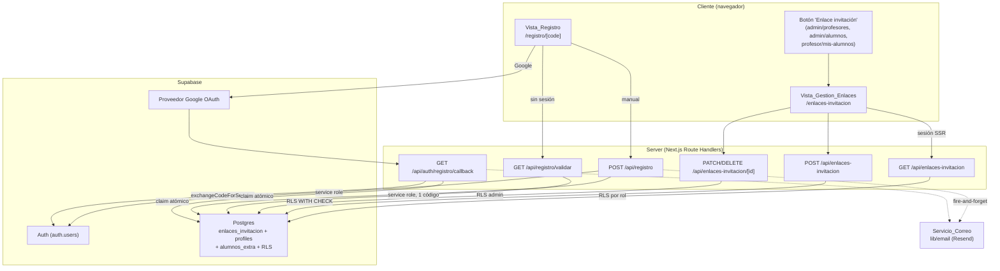
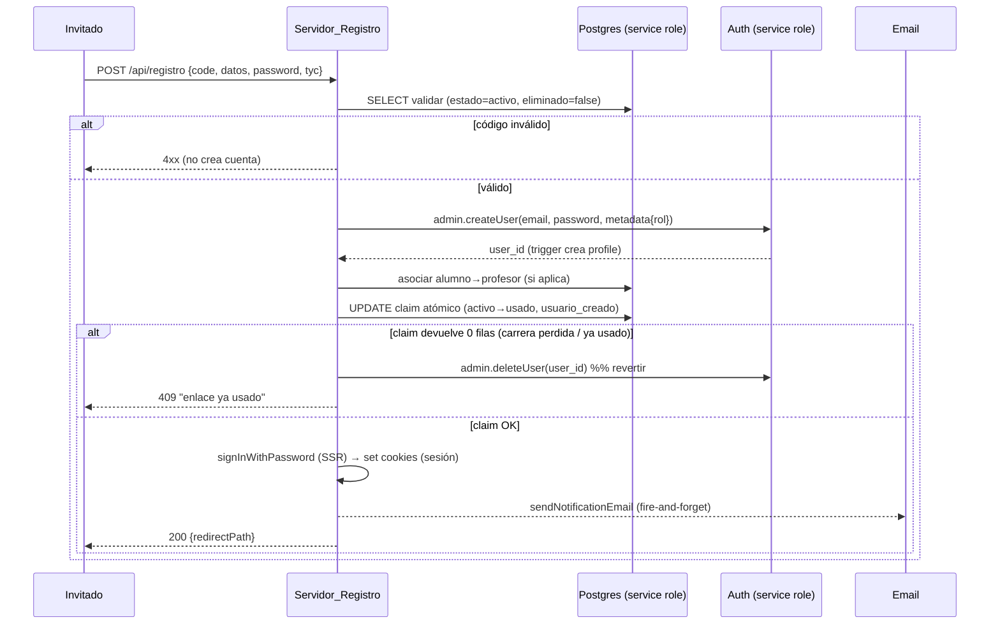

# Documento de Diseño

## Overview

Esta funcionalidad añade **enlaces de invitación autogestionados** a la aplicación CTA Graduados (Next.js 15 App Router, multi-tenant, Supabase, next-intl, Resend). Un administrador o un profesor habilitado genera un enlace; el invitado lo abre, completa sus propios datos (manualmente o con Google) y queda registrado y autenticado de inmediato. El enlace queda inutilizado tras su único uso.

El diseño se apoya en cuatro piezas existentes del proyecto y las extiende:

1. **Patrón `setup/[code]`** (`app/(auth)/setup/[code]/page.tsx` + `app/api/auth/setup/route.ts`): validación de un código vía API y aceptación de Términos y Condiciones. La nueva **Vista_Registro** reutiliza la estructura (validación previa por API, modal de T&C, control de contraseña con ojo) y la estética de la vista de login.
2. **Patrón de creación de cuentas server-side** (`app/api/admin/alumnos/route.ts`): creación de `auth.users` + perfil (trigger `handle_new_user`) + tablas extra + correo de bienvenida no bloqueante. La nueva feature replica este patrón pero **sin sesión previa del invitado**, usando el service role del lado servidor.
3. **Servicio de correo** (`lib/email/emailService.ts`): `sendNotificationEmail` con `tipo: 'invitacion_acceso'` ya existe y se invoca fire-and-forget.
4. **Componentes comunes** (`components/common/*`): `Button`, `Collapsible`, `AppSelect`, `CardActions`, `ConfirmDeleteModal`, `BackButton`, `WhoWeAre`, `AppLogo`, `StatusBadge`, `PageHeader`, etc.

### Modelo multi-tenant del proyecto (decisión de diseño clave)

Tras revisar `config/index.ts`, los archivos `.env.tenant.*` y `lib/supabase/types.ts`, se confirma que el proyecto usa un modelo **una base de datos Supabase por tenant**: el tenant activo se resuelve con `process.env.NEXT_PUBLIC_TENANT_ID` y cada tenant tiene su propio proyecto Supabase (su propia `NEXT_PUBLIC_SUPABASE_URL`). **La tabla `profiles` no tiene columna `tenant`**; el aislamiento entre tenants es estructural (bases separadas).

Implicación para los requisitos que hablan de "mismo tenant" (Req 4.1, 5.1, 5.2, 19.4, 19.8): dentro de una base de datos dada **todas las filas pertenecen al mismo tenant por construcción**, por lo que las lecturas "del mismo tenant" se cumplen automáticamente. Aun así, y para cumplir literalmente el Req 20.1 ("columna `tenant`") y aportar defensa en profundidad + portabilidad a un hipotético esquema compartido, la tabla `enlaces_invitacion` **incluye una columna `tenant`** que se rellena con `NEXT_PUBLIC_TENANT_ID` en cada inserción y se usa como filtro defensivo en las consultas. Las políticas RLS no necesitan comparar `tenant` entre filas porque no existen filas de otros tenants en la misma base.

### Decisiones de nombres y rutas (coherentes con el proyecto)

| Elemento | Valor elegido | Justificación |
|---|---|---|
| Tabla | `enlaces_invitacion` | Indicado en requisitos; `snake_case` como el resto. |
| Migración | `066_enlaces_invitacion.sql` | Siguiente consecutivo tras `065`. |
| Ruta vista pública | `/registro/[code]` | Coherente con `/setup/[code]`; segmento propio fuera de `(auth)` para controlar ancho del card y posición del logo. |
| Ruta vista gestión | `/enlaces-invitacion` | Vista compartida neutral bajo `(dashboard)`; accesible a admin y profesor habilitado. |
| API gestión | `/api/enlaces-invitacion` (+ `/[id]`) | Sigue el estilo `/api/...` del proyecto. |
| API validación pública | `GET /api/registro/validar?code=` | Endpoint server con service role; devuelve solo el código pedido. |
| API registro | `POST /api/registro` | Registro manual server-side. |
| Callback Google | `GET /api/auth/registro/callback` | Bajo `/api/auth/` como el resto de auth. |
| Param de origen | `?from=/admin/profesores` \| `?from=/admin/alumnos` | Patrón `?from=` ya usado en el proyecto. |

## Architecture

### Diagrama de componentes



### Flujo de seguridad (RLS + service role)

- **Lecturas autenticadas** (gestión): se hacen con el cliente SSR autenticado (`lib/supabase/server.ts`), de modo que **RLS** filtra por rol (admin ve todo; profesor solo `created_by = auth.uid()`). Defensa en profundidad: el endpoint además aplica chequeos de rol explícitos.
- **Mutaciones autenticadas** (crear/editar/deshabilitar/habilitar/eliminar): cliente SSR autenticado + chequeo de autorización explícito en el endpoint; RLS `WITH CHECK`/`USING` actúa como segunda barrera.
- **Validación pública del código** (sin sesión): se hace exclusivamente en el servidor con el **service role** (`lib/supabase/admin.ts`), que devuelve únicamente la fila del único código solicitado. `anon` **no tiene** políticas RLS de lectura, por lo que un cliente sin sesión no puede leer la tabla directamente.
- **Creación de cuenta sin sesión**: se ejecuta solo en el servidor con service role (bypassa RLS), cumpliendo Req 19.3.

### Atomicidad y concurrencia del consumo (Req 17.1, 17.2, 17.7, 17.9)

No existe transacción cross-system entre `auth.users` (Auth) y la tabla `enlaces_invitacion` (Postgres). La atomicidad efectiva se logra con un **claim condicional atómico** sobre la fila del enlace:

```sql
UPDATE public.enlaces_invitacion
   SET estado = 'usado', usuario_creado = $user_id, updated_at = now()
 WHERE id = $link_id
   AND estado = 'activo'
   AND eliminado = false
RETURNING id;
```

Como un `UPDATE` de fila única es atómico y la condición `estado = 'activo'` solo puede satisfacerse una vez, **a lo sumo una** solicitud concurrente "gana" el enlace (Req 17.9); las demás reciben 0 filas y se rechazan. La orquestación en el endpoint:



Para Google, el orden valida `inv` **antes** de `exchangeCodeForSession` (así un código inválido no crea ninguna cuenta, Req 13.5) y el claim atómico es idéntico; si el claim falla tras el intercambio, se cierra sesión y se elimina el usuario recién creado por este flujo.

## Components and Interfaces

### 1. Botón "Enlace invitación" (Req 1)

Se inserta junto al botón de alta de usuario en tres vistas, reutilizando el componente común `Button`:

- `app/(dashboard)/admin/profesores/page.tsx`: en el `PageHeader.actions`, junto a "Agregar profesor". Crea enlaces de tipo `profesor` o `alumno` (el tipo se elige en el modal de creación).
- `app/(dashboard)/admin/alumnos/page.tsx`: junto a "Agregar alumno".
- `app/(dashboard)/profesor/mis-alumnos/page.tsx`: junto a "Agregar alumno", **solo si** `user?.puede_crear_alumno` (mismo patrón que el botón existente "Agregar alumno", Req 1.4).

```tsx
// Patrón en PageHeader.actions
<div className="flex items-center gap-2">
  <Button variant="secondary" onClick={() => router.push('/enlaces-invitacion?from=/admin/profesores')}>
    <LinkIcon className="mr-1.5 size-4" />
    {t('enlace_invitacion')}
  </Button>
  <Button onClick={() => router.push('/admin/profesores/crear')}>
    <Plus className="mr-1.5 size-4" /> {tp('nuevo_profesor')}
  </Button>
</div>
```

El control de acceso por ruta directa (Req 1.7) se resuelve en la **Vista_Gestion_Enlaces** (ver abajo).

### 2. Vista_Gestion_Enlaces — `/enlaces-invitacion` (Req 2, 5, 6, 7, 8, 9, 10, 11)

Ruta `app/(dashboard)/enlaces-invitacion/page.tsx` (client component dentro del grupo `(dashboard)`, que ya exige sesión). 

**Control de acceso (Req 1.7, 5):** al montar se obtiene el usuario desde `useUser()`. Si no es `admin` ni (`profesor` con `puede_crear_alumno`), se redirige a `getRolRedirectPath(rol)` y no se renderiza ningún enlace. El backend (`GET /api/enlaces-invitacion`) aplica el mismo filtro por RLS, de modo que aunque se fuerce el render no se devuelven datos.

**Navegación de retorno (Req 2):** usa el componente común `BackButton`. El origen se lee de `?from=`. Lógica:
- Profesor habilitado → siempre vuelve a `/profesor/mis-alumnos` (Req 2.4), ignorando `from`.
- Admin → vuelve a `from` si es `/admin/profesores` o `/admin/alumnos`; si no hay `from` válido → `/admin/profesores` (Req 2.5).

Se pasa `fallback` al `BackButton` y, para forzar el destino exacto (no `router.back()`), se envuelve con un handler que hace `router.push(destino)`. Dado que `BackButton` actual usa `router.back()` cuando hay historial, se usará una variante con `fallback` y se navegará explícitamente mediante un `onClick` propio o un pequeño wrapper; se documenta el destino calculado en `destinoRetorno(rol, from)`.

**Estructura de la vista:**
- `PageHeader` con título + `BackButton`.
- Botón "Crear enlace" → abre `ModalCrearEnlace`.
- Filtros dinámicos (Creador, Tipo) — ver sección 6.
- Listado agrupado por estado en `Collapsible` — ver sección 4.

Datos vía React Query (`useQuery(['enlaces-invitacion'])` → `GET /api/enlaces-invitacion`). Tras cada mutación, `queryClient.invalidateQueries({ queryKey: ['enlaces-invitacion'] })`.

### 3. ModalCrearEnlace (Req 3, 4)

Usa el componente común `Modal`. Campos:
- Selector de **Tipo_Enlace** (`profesor` / `alumno`) con `AppSelect`. Para profesor habilitado, el tipo queda fijo en `alumno` (no se muestra opción `profesor`, Req 5.4).
- Si tipo = `alumno`: selector de **Profesor_Asignado** con `AppSelect`, poblado con `GET /api/enlaces-invitacion/profesores` (perfiles con `rol IN ('profesor','admin')`). Opción "Sin profesor asignado" (valor vacío) permitida (Req 4.6). Para profesor habilitado no se muestra (se autoasigna a sí mismo).

`POST /api/enlaces-invitacion` con `{ tipo, profesor_asignado }`. El servidor deriva `created_by` de la sesión y valida autorización.

### 4. Agrupación por estado en Collapsible (Req 7)

La agrupación es **pura y derivada de los datos** (sin lista fija de estados). Lógica en un helper testeable:

```ts
// lib/enlaces/agrupar.ts
export interface EnlaceRow { id: string; estado: string; /* ...resto */ }

/** Devuelve los grupos por estado en orden de primera aparición, omitiendo los vacíos. */
export function agruparPorEstado(enlaces: EnlaceRow[]): Array<{ estado: string; items: EnlaceRow[] }> {
  const orden: string[] = [];
  const mapa = new Map<string, EnlaceRow[]>();
  for (const e of enlaces) {
    if (!mapa.has(e.estado)) { mapa.set(e.estado, []); orden.push(e.estado); }
    mapa.get(e.estado)!.push(e);
  }
  return orden.map((estado) => ({ estado, items: mapa.get(estado)! }))
              .filter((g) => g.items.length > 0);
}
```

Cada grupo se renderiza con `Collapsible` (`defaultOpen={false}`, Req 7.4), con `badge={items.length}` y `title` = etiqueta i18n del estado + recuento (Req 7.8). Como la lista de entrada se recalcula con `useMemo` a partir de los datos de React Query y los filtros, un grupo que queda vacío desaparece en la misma actualización (Req 7.6, 7.7), y un estado nuevo en los datos genera su `Collapsible` sin cambios de código (Req 7.2, 7.3). La etiqueta del estado usa una función `etiquetaEstado(estado, t)` que cae a una representación legible del propio string si no hay traducción (extensibilidad).

### 5. Fila de enlace y acciones (Req 6, 8, 9, 11)

Cada fila muestra (Req 6.1): nombre del Creador, fecha/hora de creación (`dd/MM/yyyy HH:mm` con `date-fns`), Estado (`StatusBadge` o `Badge`), Tipo. Profesor asignado o indicador de ausencia (Req 6.2, 6.3). Para enlaces `usado`: nombre del usuario creado o indicador "no disponible" (Req 11.1, 11.2).

Acciones por fila con el componente común `CardActions` (array `actions`):
- **editar** (`Pencil`): abre `ModalEditarEnlace` (solo profesor_asignado, solo tipo alumno activo — Req 8.6).
- **compartir** (`LinkIcon`/`Share2`): copia y muestra popover (sección 9).
- **alternar estado**: "deshabilitar" si `activo`, "habilitar" si `deshabilitado` (Req 8.1, 8.3, 8.4). Oculta/omitida para `usado`.
- **eliminar** (`Trash2`, `danger`): abre `ConfirmDeleteModal` (Req 8.8).
- **navegar al usuario creado** (solo `usado`, cuenta activa): "ver perfil" (alumno → `/admin/alumnos/[id]`) o "ver clases" (profesor → `/admin/profesores/[id]/horarios`) (Req 11.3–11.7). Oculto si la cuenta fue desactivada/eliminada.

`CardActions` recibe `actions: CardAction[]` donde cada acción tiene `{ key, label, icon, onClick, danger? }`. Las acciones se construyen condicionalmente según estado/tipo/permiso.

**Compartir (Req 9):** componente `BotonCompartir` con popover propio (no hay componente común de popover de "copiado"; se implementa con elemento nativo posicionado, Req 20.5). Lógica:

```ts
function construirUrlEnlace(base: string, code: string): string {
  // Une sin barras duplicadas (Req 9.1)
  const limpio = `${base.replace(/\/+$/, '')}/registro/${code.replace(/^\/+/, '')}`;
  return limpio;
}
```

Al hacer clic: `navigator.clipboard.writeText(url)`. Éxito → mostrar popover "Copiado" y `setTimeout` de 2000 ms; un nuevo clic limpia el timer previo y reinicia (Req 9.2–9.4). Fallo o `clipboard` no disponible → indicación de error (toast), sin popover de éxito, sin tocar el portapapeles (Req 9.5).

### 6. Filtros (Req 10)

Helper puro `lib/enlaces/filtrar.ts`:

```ts
export interface FiltroState { creador: string | null; tipo: string | null; }
export function filtrarEnlaces(enlaces: EnlaceRow[], f: FiltroState): EnlaceRow[] {
  return enlaces.filter((e) =>
    (f.creador === null || e.created_by === f.creador) &&
    (f.tipo === null || e.tipo === f.tipo));
}
/** Opciones distintas presentes en los datos visibles. */
export function opcionesDistintas<K extends keyof EnlaceRow>(enlaces: EnlaceRow[], campo: K): string[] { /* ... */ }
```

Controles con `AppSelect`. Un filtro con menos de 2 valores distintos se renderiza `disabled` (Req 10.3, `AppSelect` soporta `disabled`). El filtrado es cliente puro y se aplica con `useMemo` (Req 10.4 < 1 s). Combinación AND de ambos filtros (Req 10.6). Mensaje de "sin coincidencias" cuando el resultado es vacío (Req 10.9). Las opciones de tipo se derivan de los datos visibles (Req 10.5).

### 7. Vista_Registro pública — `/registro/[code]` (Req 12–16, 18)

Segmento propio `app/registro/[code]/page.tsx` con `app/registro/layout.tsx` dedicado (fuera de `(auth)` para no heredar el `max-w-md`). Layout:
- `AppLogo variant="login"` arriba a la izquierda (Req 12.2).
- Arriba a la derecha: `WhoWeAre` (se autodesactiva si el tenant no tiene contenido — devuelve `null`, Req 12.3, 12.4) + `ThemeToggle` (Req 12.5, 12.6).
- Card centrado con `max-w-lg` (32rem), **estrictamente mayor** que el `max-w-md` (28rem) del login (Req 12.7).

Flujo de la página (client):
1. `useQuery(['registro-validar', code])` → `GET /api/registro/validar?code=`. Si inválido/no activo/eliminado/no existe → muestra la **ventana de error de enlace no válido** reutilizada del patrón de `setup` (icono + mensaje + único botón "Ir a login"), Req 18.
2. Si válido: el endpoint devuelve `{ tipo }`. Render del formulario:
   - **Bloque Google** (Req 13): botón "Registrarse con Google" + divisor "o".
   - **Formulario manual** (Req 14, 15, 16): campos según `tipo`, contraseña + repetir con ojo, bloque T&C reutilizado, botón "Crear cuenta".

**Bloque T&C reutilizado (Req 16):** el `TerminosModal` + checkbox actualmente viven inline en `setup/[code]/page.tsx`. Se **extraen** a un componente compartido `components/auth/TerminosAceptacion.tsx` (modal + checkbox + carga de `/api/legal/terminos`), y `setup/[code]` se refactoriza para usarlo, de modo que ambas vistas usen exactamente el mismo componente (Req 16.1). Si el tenant no tiene T&C configurados, el enlace muestra un error y conserva la vista (Req 16.4).

**Validación del formulario (Req 14, 15):** con `react-hook-form` + `zod` (patrón del proyecto, `lib/validations/`). Esquema por tipo (`registroAlumnoSchema`, `registroProfesorSchema`). El botón "Crear cuenta" está deshabilitado mientras falte un campo obligatorio (vacío = sin caracteres o solo espacios), la contraseña no cumpla 6–128, no coincidan las contraseñas, o no se acepten los T&C. Mensajes en línea < 1 s; se retiran al corregir.

### 8. Endpoints API

Contratos (todos JSON, errores `{ error: CODE, message? }`):

| Método/Ruta | Auth | Cuerpo / Query | Respuesta | Requisitos |
|---|---|---|---|---|
| `GET /api/enlaces-invitacion` | sesión (admin o profesor hab.) | — | `EnlaceListItem[]` (scoped por RLS) | 5.1, 5.2, 6, 11, 19.4, 19.7 |
| `GET /api/enlaces-invitacion/profesores` | sesión admin | — | `{id,nombre,apellido,rol}[]` (`rol IN profesor,admin`) | 4.1 |
| `POST /api/enlaces-invitacion` | sesión | `{tipo, profesor_asignado?}` | `{id, code}` | 3, 4 |
| `PATCH /api/enlaces-invitacion/[id]` | sesión admin | `{profesor_asignado?}` o `{estado:'activo'\|'deshabilitado'}` | `{ok:true}` | 8.3–8.7 |
| `DELETE /api/enlaces-invitacion/[id]` | sesión admin | — | `{ok:true}` (soft) | 8.2 |
| `GET /api/registro/validar` | público (service role) | `?code=` | `{valid, tipo?}` (solo ese código) | 13.4, 18, 19.2 |
| `POST /api/registro` | público (service role) | `{code, datos, password, confirmar, aceptaTyC}` | `{redirectPath}` + cookies sesión | 14, 15, 16, 17 |
| `GET /api/auth/registro/callback` | público | `?code=<auth>&inv=<codigo>` | redirect (set sesión) | 13.4–13.6, 17 |

Reglas de autorización del `POST /api/enlaces-invitacion` (Req 3):
- `admin`: puede crear `profesor` o `alumno`; `alumno` puede incluir `profesor_asignado` (validado: pertenece a la base y `rol IN ('profesor','admin')`, Req 4.7) o vacío (Req 4.6).
- `profesor` con `puede_crear_alumno`: solo `alumno`, `created_by = self`, `profesor_asignado = self` (Req 3.3); si pide `profesor` → 403 sin persistir (Req 3.6).
- Otro → 403 (Req 3.8). En todo rechazo no se persiste nada (Req 3.9, 4.7).

El código se genera con `generateShortCode` (`lib/utils/invitations.ts`, ya usa `crypto.randomBytes`). Para ≥128 bits de entropía (Req 3.4) se usa longitud **24** sobre un alfabeto de 54 símbolos (`log2(54)·24 ≈ 138 bits`). Se documenta este cálculo.

### 9. Google OAuth (Req 13)

Frontend (botón):
```ts
const supabase = createClient(); // browser
await supabase.auth.signInWithOAuth({
  provider: 'google',
  options: { redirectTo: `${window.location.origin}/api/auth/registro/callback?inv=${code}` },
});
```
El `code` de invitación viaja en `?inv=`; Supabase añade su propio `?code=<auth_code>` al volver. El callback (route handler) usa el cliente SSR (`@supabase/ssr` ya está configurado en PKCE por defecto) y valida `inv` **antes** de `exchangeCodeForSession` (Req 13.4, 13.5). Tras el intercambio: asegura el `rol` correcto del perfil según `tipo`, crea asociación si alumno, hace el claim atómico, dispara correo y redirige al dashboard. Cancelación/fallo de Google → redirige a `/registro/[code]?error=google` (Req 13.6).

## Data Models

### Tabla `enlaces_invitacion`

| Columna | Tipo | Notas |
|---|---|---|
| `id` | `uuid` PK | `default uuid_generate_v4()` (coherente con migraciones previas). |
| `tenant` | `text NOT NULL` | `= NEXT_PUBLIC_TENANT_ID`; defensa en profundidad / portabilidad. |
| `codigo` | `text NOT NULL UNIQUE` | Código aleatorio ≥128 bits. |
| `tipo` | `text NOT NULL` | `CHECK (tipo IN ('profesor','alumno'))`. |
| `estado` | `text NOT NULL DEFAULT 'activo'` | **Sin enum rígido**: valores conocidos `activo`/`usado`/`deshabilitado`; la lógica de agrupación deriva estados de los datos (Req 7.2). |
| `created_by` | `uuid` FK→`profiles(id)` `ON DELETE SET NULL` | Creador. |
| `profesor_asignado` | `uuid` FK→`profiles(id)` `ON DELETE SET NULL` NULL | Solo relevante para tipo `alumno`. |
| `usuario_creado` | `uuid` FK→`profiles(id)` `ON DELETE SET NULL` NULL | Usuario registrado con el enlace. |
| `eliminado` | `boolean NOT NULL DEFAULT false` | Soft-delete (Req 8.2). |
| `deleted_at` | `timestamptz` NULL | Marca temporal del borrado lógico. |
| `created_at` | `timestamptz NOT NULL DEFAULT now()` | |
| `updated_at` | `timestamptz NOT NULL DEFAULT now()` | |

Decisiones:
- `estado` como `TEXT` (no `enum` de Postgres) para extensibilidad sin migración de tipo y para que la agrupación del front no dependa de una lista fija.
- FKs `ON DELETE SET NULL`: borrar un perfil no bloquea ni elimina el enlace; la fila sobrevive y la UI muestra el indicador de "no disponible"/"sin profesor" (Req 4.8, 11.2).
- El consumo conserva el histórico: un enlace `usado` no se borra; el `eliminado` es independiente del `estado`.

### Índices

```sql
CREATE UNIQUE INDEX IF NOT EXISTS enlaces_invitacion_codigo_key       ON public.enlaces_invitacion(codigo);
CREATE INDEX        IF NOT EXISTS enlaces_invitacion_created_by_idx   ON public.enlaces_invitacion(created_by);
CREATE INDEX        IF NOT EXISTS enlaces_invitacion_estado_idx       ON public.enlaces_invitacion(estado);
CREATE INDEX        IF NOT EXISTS enlaces_invitacion_profesor_idx     ON public.enlaces_invitacion(profesor_asignado);
CREATE INDEX        IF NOT EXISTS enlaces_invitacion_usuario_idx      ON public.enlaces_invitacion(usuario_creado);
```

### Políticas RLS (Req 19)

```sql
ALTER TABLE public.enlaces_invitacion ENABLE ROW LEVEL SECURITY;

-- SELECT: admin ve todo (Req 5.1, 19.4)
CREATE POLICY "admin lee enlaces" ON public.enlaces_invitacion FOR SELECT
  USING ((SELECT rol FROM public.profiles WHERE id = auth.uid()) = 'admin');

-- SELECT: profesor ve solo los suyos (Req 5.2, 19.7)
CREATE POLICY "profesor lee sus enlaces" ON public.enlaces_invitacion FOR SELECT
  USING (created_by = auth.uid());

-- INSERT: admin cualquiera; profesor habilitado solo alumno propio (Req 3, 5.4)
CREATE POLICY "crear enlaces" ON public.enlaces_invitacion FOR INSERT
  WITH CHECK (
    created_by = auth.uid() AND (
      (SELECT rol FROM public.profiles WHERE id = auth.uid()) = 'admin'
      OR (
        (SELECT rol FROM public.profiles WHERE id = auth.uid()) = 'profesor'
        AND (SELECT puede_crear_alumno FROM public.profiles WHERE id = auth.uid()) = true
        AND tipo = 'alumno'
      )
    )
  );

-- UPDATE/DELETE: solo admin (Req 5.6: profesor no edita/deshabilita/elimina)
CREATE POLICY "admin actualiza enlaces" ON public.enlaces_invitacion FOR UPDATE
  USING ((SELECT rol FROM public.profiles WHERE id = auth.uid()) = 'admin');
CREATE POLICY "admin elimina enlaces" ON public.enlaces_invitacion FOR DELETE
  USING ((SELECT rol FROM public.profiles WHERE id = auth.uid()) = 'admin');
```

- **`anon` no tiene ninguna política** → no puede leer ni escribir (Req 19.5, 19.6). La validación pública y el claim de consumo se hacen con **service role** en el servidor (bypassa RLS), devolviendo solo la fila del código solicitado (Req 19.2, 19.3).
- El borrado de la UI es un `UPDATE eliminado=true` (soft-delete), cubierto por la política de UPDATE de admin. El `DELETE` físico no se usa desde la app; la política `DELETE` admin se incluye por completitud.

### Tipos TypeScript (`lib/supabase/types.ts`, actualización manual — Req 20.3)

Se añade dentro de `Database['public']['Tables']`:

```ts
enlaces_invitacion: {
  Row: {
    id: string
    tenant: string
    codigo: string
    tipo: string
    estado: string
    created_by: string | null
    profesor_asignado: string | null
    usuario_creado: string | null
    eliminado: boolean
    deleted_at: string | null
    created_at: string
    updated_at: string
  }
  Insert: {
    id?: string
    tenant: string
    codigo: string
    tipo: string
    estado?: string
    created_by?: string | null
    profesor_asignado?: string | null
    usuario_creado?: string | null
    eliminado?: boolean
    deleted_at?: string | null
    created_at?: string
    updated_at?: string
  }
  Update: {
    id?: string
    tenant?: string
    codigo?: string
    tipo?: string
    estado?: string
    created_by?: string | null
    profesor_asignado?: string | null
    usuario_creado?: string | null
    eliminado?: boolean
    deleted_at?: string | null
    created_at?: string
    updated_at?: string
  }
  Relationships: [
    { foreignKeyName: "enlaces_invitacion_created_by_fkey"; columns: ["created_by"]; isOneToOne: false; referencedRelation: "profiles"; referencedColumns: ["id"] },
    { foreignKeyName: "enlaces_invitacion_profesor_asignado_fkey"; columns: ["profesor_asignado"]; isOneToOne: false; referencedRelation: "profiles"; referencedColumns: ["id"] },
    { foreignKeyName: "enlaces_invitacion_usuario_creado_fkey"; columns: ["usuario_creado"]; isOneToOne: false; referencedRelation: "profiles"; referencedColumns: ["id"] }
  ]
}
```

Se exporta además un alias: `export type EnlaceInvitacion = Tables<'enlaces_invitacion'>;`.

### Migración `066_enlaces_invitacion.sql` (idempotente — Req 20.1, 20.2)

Estructura (resumen; el archivo completo se entrega en la fase de tareas):

```sql
-- 066_enlaces_invitacion.sql — Enlaces de invitación autogestionados.
-- Idempotente: IF NOT EXISTS + DO $$ guards en políticas.

CREATE TABLE IF NOT EXISTS public.enlaces_invitacion (
  id                uuid        PRIMARY KEY DEFAULT uuid_generate_v4(),
  tenant            text        NOT NULL,
  codigo            text        NOT NULL UNIQUE,
  tipo              text        NOT NULL,
  estado            text        NOT NULL DEFAULT 'activo',
  created_by        uuid        REFERENCES public.profiles(id) ON DELETE SET NULL,
  profesor_asignado uuid        REFERENCES public.profiles(id) ON DELETE SET NULL,
  usuario_creado    uuid        REFERENCES public.profiles(id) ON DELETE SET NULL,
  eliminado         boolean     NOT NULL DEFAULT false,
  deleted_at        timestamptz,
  created_at        timestamptz NOT NULL DEFAULT now(),
  updated_at        timestamptz NOT NULL DEFAULT now()
);

-- CHECK de tipo idempotente
ALTER TABLE public.enlaces_invitacion DROP CONSTRAINT IF EXISTS enlaces_invitacion_tipo_check;
ALTER TABLE public.enlaces_invitacion ADD  CONSTRAINT enlaces_invitacion_tipo_check CHECK (tipo IN ('profesor','alumno'));

-- Índices (IF NOT EXISTS) ...
-- ENABLE RLS + políticas dentro de DO $$ ... pg_policies guards ...
```

La idempotencia se garantiza con `CREATE TABLE IF NOT EXISTS`, `CREATE INDEX IF NOT EXISTS`, `DROP CONSTRAINT IF EXISTS` antes de añadir el `CHECK`, y los bloques `DO $$ ... IF NOT EXISTS (SELECT 1 FROM pg_policies ...) ...` para cada política (patrón idéntico a las migraciones 033/047).

## Correctness Properties

*Una propiedad es una característica o comportamiento que debe cumplirse en todas las ejecuciones válidas del sistema: es una afirmación formal de lo que el sistema debe hacer. Las propiedades son el puente entre la especificación legible por humanos y las garantías de correctitud verificables por máquina.*

El grueso de esta funcionalidad es UI, CRUD, RLS y flujos de autenticación/OAuth, que se validan con tests de ejemplo e integración (ver Testing Strategy). No obstante, la lógica de negocio se concentra en un conjunto de **funciones puras** extraíbles (agrupación, filtrado, construcción de URL, autorización de creación, validación de código y de formulario, transición de estado, resolución de navegación y de profesor asociado). Esas funciones sí admiten propiedades universales y se especifican a continuación.

### Property 1: Partición por estado conserva todos los elementos sin grupos vacíos

*Para toda* lista de enlaces, `agruparPorEstado(lista)` produce grupos tales que: (a) la concatenación de los `items` de todos los grupos es una permutación exacta de la lista de entrada (ningún enlace perdido ni duplicado); (b) cada enlace aparece exactamente en el grupo cuyo `estado` coincide con el suyo; (c) ningún grupo está vacío; (d) los `estado` de los grupos aparecen en el orden de primera aparición en la lista; y (e) el `badge`/recuento de cada grupo es igual a `items.length`.

**Validates: Requirements 7.1, 7.2, 7.3, 7.6, 7.7, 7.8**

### Property 2: La URL del enlace se construye sin barras duplicadas

*Para toda* URL base y todo código (con o sin barras sobrantes en el borde de unión), `construirUrlEnlace(base, code)` devuelve una cadena que contiene la ruta `/registro/` y el código, sin ninguna secuencia `//` salvo la del esquema (`https://`), y cuyo resultado es invariante ante barras finales sobrantes en `base` o iniciales en `code`.

**Validates: Requirements 9.1**

### Property 3: El filtrado es un subconjunto coherente con la conjunción de filtros

*Para toda* lista de enlaces y todo estado de filtros `{creador, tipo}`: el resultado de `filtrarEnlaces` es siempre un subconjunto (preservando orden) de la entrada; cuando ambos filtros son `null` el resultado es la entrada completa; cuando solo uno está activo el resultado contiene exactamente los enlaces que igualan ese valor; y cuando ambos están activos el resultado contiene exactamente los enlaces que igualan ambos valores simultáneamente (intersección).

**Validates: Requirements 10.4, 10.6, 10.7, 10.8**

### Property 4: Las opciones de filtro son los valores distintos presentes y se deshabilitan con menos de dos

*Para toda* lista de enlaces visibles y todo campo de filtro (`creador` o `tipo`), `opcionesDistintas(lista, campo)` devuelve exactamente el conjunto de valores distintos presentes en ese campo (ningún valor ausente de los datos, ningún valor presente omitido), y el control del filtro se marca deshabilitado si y solo si ese conjunto tiene menos de dos elementos.

**Validates: Requirements 10.2, 10.3, 10.5**

### Property 5: La autorización de creación deriva los campos del enlace o rechaza, según rol y tipo

*Para todo* actor (`rol`, `puede_crear_alumno`) y toda solicitud de creación (`tipo`, `profesor_asignado`), `authorizeCreate(actor, solicitud)`: si el actor es `admin`, acepta cualquier `tipo` con `created_by = actor` y `estado = 'activo'`; si es `profesor` con `puede_crear_alumno` y `tipo = 'alumno'`, acepta con `created_by = actor`, `profesor_asignado = actor` y `estado = 'activo'`; en cualquier otro caso (profesor pidiendo `profesor`, profesor sin permiso, o rol distinto) devuelve un rechazo de autorización. Todo resultado de rechazo implica "no persistir" (la función nunca devuelve un enlace a crear cuando rechaza).

**Validates: Requirements 3.1, 3.2, 3.3, 3.6, 3.8, 3.9, 5.4**

### Property 6: La asociación alumno→profesor solo ocurre con un profesor válido y activo

*Para todo* enlace de tipo `alumno` y todo estado del `profesor_asignado` (ausente, inexistente, cuenta desactivada, o existente y activo con rol `profesor`/`admin`), `resolverProfesorAsociado` devuelve el identificador del profesor si y solo si el profesor existe, está activo y tiene rol válido; en todos los demás casos devuelve `null` (alumno creado sin asociación).

**Validates: Requirements 4.4, 4.5, 4.8**

### Property 7: La transición de estado respeta el ciclo activo↔deshabilitado e impide reactivar un usado

*Para todo* enlace, `transicionEstado(estado, accion)`: deshabilitar un enlace `activo` produce `deshabilitado` y habilitar uno `deshabilitado` produce `activo`, de modo que deshabilitar seguido de habilitar devuelve el enlace a `activo` (round-trip); e intentar habilitar un enlace con estado `usado` siempre produce un rechazo que conserva el estado `usado`.

**Validates: Requirements 8.3, 8.4, 8.5**

### Property 8: El conjunto de acciones de fila depende de estado, tipo y rol

*Para todo* enlace y rol del usuario, `accionesDeFila(enlace, rol)` incluye la acción "deshabilitar" si y solo si el estado es `activo`, "habilitar" si y solo si es `deshabilitado`, nunca una acción de alternar estado cuando es `usado`, e incluye el control de navegación al usuario creado si y solo si el estado es `usado` y la cuenta del usuario creado está activa.

**Validates: Requirements 8.1, 11.3, 11.4, 11.7**

### Property 9: Un código es válido para registro si y solo si existe, está activo y no eliminado

*Para todo* enlace almacenado, `validarCodigo` lo considera válido para registro si y solo si el código existe, su `estado` es `activo` y `eliminado` es falso; cualquier otra combinación (inexistente, `usado`, `deshabilitado`, eliminado, o cualquier estado futuro distinto de `activo`) se considera no válida.

**Validates: Requirements 13.4, 17.5, 17.6, 18.1, 18.3**

### Property 10: La validez del registro exige todos los obligatorios, contraseña en rango, coincidencia y T&C

*Para todo* formulario de registro y tipo (`profesor`/`alumno`), la regla compartida `registroEsValido(form, tipo)` (usada tanto para habilitar el botón "Crear cuenta" en el cliente como para aceptar la solicitud en el servidor) es verdadera si y solo si: todos los campos obligatorios del tipo son no vacíos tras recortar espacios; la contraseña tiene entre 6 y 128 caracteres; la contraseña y su repetición coinciden; y los Términos y Condiciones están aceptados. Si cualquiera de esas condiciones falla, la regla es falsa (botón deshabilitado en cliente; rechazo de validación en servidor sin crear cuenta).

**Validates: Requirements 14.3, 14.4, 14.7, 14.8, 15.1, 15.2, 15.6, 16.2, 16.5**

### Property 11: El control de navegación al usuario creado apunta al destino correcto por tipo

*Para todo* enlace `usado` con usuario creado, `controlNavegacionUsuario(enlace, perfilUsuario)` devuelve la ruta de perfil del alumno (`/admin/alumnos/[id]`) cuando el tipo es `alumno` y la cuenta está activa, la ruta de clases del profesor (`/admin/profesores/[id]/horarios`) cuando el tipo es `profesor` y la cuenta está activa, y `null` cuando la cuenta está desactivada o el perfil ya no existe.

**Validates: Requirements 11.3, 11.4, 11.5, 11.6, 11.7**

### Property 12: El destino de retorno depende del rol y del origen registrado

*Para todo* rol y todo valor de origen `from`, `destinoRetorno(rol, from)` devuelve `/profesor/mis-alumnos` cuando el rol es `profesor` (independientemente de `from`); para `admin`, devuelve `from` cuando este es `/admin/profesores` o `/admin/alumnos`, y `/admin/profesores` (fallback) cuando `from` es ausente o no es uno de esos dos valores.

**Validates: Requirements 2.2, 2.4, 2.5**

### Property 13: El formato de fecha de creación contiene día, mes, año, hora y minuto

*Para toda* marca temporal de creación, `formatearFechaCreacion(fecha)` produce una cadena que contiene el día, el mes, el año, la hora y el minuto (formato `dd/MM/yyyy HH:mm`), de modo que los cinco componentes son recuperables de la salida.

**Validates: Requirements 6.1**

## Error Handling

### Endpoints de gestión (autenticados)

- **No autenticado** → `401 { error: 'NO_AUTORIZADO' }` (el grupo `(dashboard)` ya redirige a `/login`; el endpoint lo refuerza).
- **Rol insuficiente** → `403 { error: 'PROHIBIDO' }`. Profesor pidiendo enlace `profesor` (Req 3.6) o acción sobre enlace ajeno (Req 5.5, 5.6) → `403` sin mutar la fila (garantizado además por RLS).
- **Validación** (p. ej. `profesor_asignado` inexistente o con rol inválido, Req 4.7; `tipo` desconocido) → `422 { error: 'VALIDACION', message }` sin persistir nada (Req 3.9, 4.7).
- **Habilitar un `usado`** (Req 8.5) → `409 { error: 'ENLACE_USADO' }`, estado conservado; la UI muestra toast de error.
- **Fallo de DB en mutación** (Req 8.10) → `500`; la UI no aplica cambios optimistas o los revierte e informa con `toast.error`, conservando estado/profesor previos.

### Vista de gestión (cliente)

- Errores de carga/mutación se muestran con `toast` (`sonner`, patrón del proyecto). Tras una mutación fallida se invalida la query para re-sincronizar con el servidor (estado/profesor previos, Req 8.10).
- `ConfirmDeleteModal` para eliminar; cancelar no muta (Req 8.9).
- Copia al portapapeles fallida → `toast.error`, sin popover de éxito, portapapeles intacto (Req 9.5).

### Validación pública del código (`GET /api/registro/validar`)

- Falta `code` → `400`. Código inexistente / no activo / eliminado → `200 { valid: false }` (no se filtra el motivo exacto para no exponer información; la UI muestra la ventana de error única, Req 18). Devuelve **solo** la fila consultada (Req 19.2).

### Registro (`POST /api/registro` y callback Google)

- **Validación de entrada** (obligatorios, contraseña 6–128, coincidencia, T&C) → `422 { error: 'VALIDACION', campos }` sin crear cuenta (Req 14.8, 15.6, 16.5).
- **Código no activo en el momento del registro** → `409 { error: 'ENLACE_NO_DISPONIBLE' }`, sin crear cuenta, sin tocar el enlace (Req 17.6).
- **Carrera perdida / claim devuelve 0 filas** → se elimina el usuario recién creado por este flujo y se responde `409 { error: 'ENLACE_USADO' }` (Req 17.7, 17.9).
- **Email ya registrado** (Auth) → `409 { error: 'EMAIL_EN_USO' }` con mensaje claro; no se consume el enlace.
- **Fallo de creación / asociación / claim** → compensación (revertir usuario creado), enlace permanece `activo` sin usuario asociado, `500 { error: 'REGISTRO_FALLIDO' }` (Req 17.7).
- **Fallo del correo de bienvenida** → ignorado para el resultado (fire-and-forget; `sendNotificationEmail` nunca lanza). La cuenta, el estado `usado`, la asociación y la sesión se conservan (Req 17.8).
- **Google cancelado/fallido** → redirección a `/registro/[code]?error=google`, sin cuenta creada; la vista muestra mensaje de error (Req 13.6). Si Google completa pero el código es inválido → no se crea cuenta, mensaje de "enlace no válido" (Req 13.5); si el usuario de Auth ya se intercambió, se cierra la sesión y se elimina el usuario creado por este flujo.

### Seguridad

- **RLS** activo en `enlaces_invitacion`; `anon` sin políticas (Req 19.1, 19.5, 19.6). Toda lectura sin sesión y la creación de cuenta usan **service role solo en el servidor** (`lib/supabase/admin.ts`), nunca expuesto al cliente (Req 19.3).
- El service role solo se importa en route handlers (archivos server). Se documenta que `SUPABASE_SERVICE_ROLE_KEY` no lleva prefijo `NEXT_PUBLIC_`.
- Endpoint público de registro: validación estricta de entrada y `code` antes de cualquier escritura; sin confiar en datos del cliente para `rol`/`tipo` (se derivan del enlace en servidor).

## Testing Strategy

Enfoque dual: **tests de ejemplo/integración** para UI, RLS, OAuth y efectos de base de datos; **tests de propiedad (PBT)** para las funciones puras de lógica de negocio. Las funciones puras se extraen deliberadamente a `lib/enlaces/` y `lib/validations/` para hacerlas testeables de forma aislada.

### Librería y configuración de PBT

- **Librería:** `fast-check` (estándar para TypeScript; no se implementa PBT a mano). Runner: `vitest` (ejecución única con `--run`, sin watch).
- **Iteraciones:** mínimo **100** por propiedad (`fc.assert(fc.property(...), { numRuns: 100 })`).
- **Etiqueta** en cada test de propiedad, en comentario, con el formato:
  `// Feature: enlaces-invitacion-registro, Property {n}: {texto de la propiedad}`
- Una sola prueba de propiedad por cada Propiedad de Correctitud (Propiedades 1–13).

Funciones bajo prueba y generadores:
- `agruparPorEstado` (Prop 1): generar arrays de enlaces con `estado` arbitrario (incluyendo estados "futuros" no contemplados) → verificar partición/orden/recuento.
- `construirUrlEnlace` (Prop 2): generar bases con 0..n barras finales y códigos con 0..n barras iniciales.
- `filtrarEnlaces` (Prop 3) y `opcionesDistintas`/`deshabilitado` (Prop 4): generar listas con `created_by`/`tipo` de un dominio pequeño para forzar colisiones.
- `authorizeCreate` (Prop 5): generar actores `{rol ∈ admin/profesor/alumno, puede_crear_alumno}` × solicitudes `{tipo, profesor_asignado}`.
- `resolverProfesorAsociado` (Prop 6): generar estado del profesor (ausente/inexistente/inactivo/activo×rol).
- `transicionEstado` (Prop 7): generar estado inicial ∈ {activo, deshabilitado, usado, …} × acción.
- `accionesDeFila` (Prop 8): generar enlace `{estado, tipo, usuario_creado, cuentaActiva}` × rol.
- `validarCodigo` (Prop 9): generar enlace `{estado, eliminado}` (incluyendo estados arbitrarios).
- `registroEsValido` (Prop 10): generar formularios `{campos, password, confirmar, aceptaTyC}` incluyendo cadenas de solo espacios y longitudes límite (5/6/128/129).
- `controlNavegacionUsuario` (Prop 11): generar `{tipo, cuentaActiva, perfilExiste}`.
- `destinoRetorno` (Prop 12): generar `{rol, from ∈ rutas válidas/ inválidas/ vacío}`.
- `formatearFechaCreacion` (Prop 13): generar fechas arbitrarias (`fc.date`).

### Tests de ejemplo (unitarios)

- Render de botones "Enlace invitación" por rol/permiso (Req 1).
- Render condicional de fila: profesor asignado vs indicador de ausencia; usuario creado vs "no disponible" (Req 6.2, 6.3, 11.1, 11.2).
- Mensajes de listado/filtros vacíos (Req 6.5, 10.9).
- Card de registro con `max-w-lg` > login `max-w-md` (Req 12.7).
- Comportamiento temporal del popover "copiado" (timer 2000 ms y reinicio) con timers simulados (Req 9.2–9.4).
- Mostrar/ocultar contraseña con el control de ojo (Req 15.3–15.5).
- Modal de T&C compartido y caso sin contenido configurado (Req 16.1, 16.3, 16.4).

### Tests de integración

- **RLS** (Req 19): con cliente `anon` verificar que no se puede leer la tabla ni un conjunto; con sesión admin se leen todos; con sesión profesor solo los propios. 1–3 ejemplos representativos.
- **Consumo atómico y concurrencia** (Req 17.1, 17.2, 17.9): lanzar dos registros concurrentes contra el mismo código y verificar que exactamente uno tiene éxito y el otro recibe `409`.
- **Compensación** (Req 17.7): forzar fallo del claim tras crear el usuario y verificar que no queda cuenta ni el enlace queda `usado`.
- **Correo de bienvenida** (Req 17.4, 17.8): con `sendNotificationEmail` mockeado, verificar que se invoca tras el éxito y que un fallo no revierte el registro.
- **Sesión establecida** (Req 17.3): tras registro, las cookies de sesión permiten acceder a una ruta protegida.
- **Migración idempotente** (Req 20.1, 20.2): aplicar `066` dos veces seguidas sobre una base limpia y verificar mismo esquema, sin error ni objetos duplicados.

### Tests de humo / verificación final (Req 20.6–20.8)

- `RLS` habilitado en la tabla (consulta a `pg_class.relrowsecurity`).
- Build de producción (`next build`) sin errores.
- `tsc --noEmit` sin errores (incluye consistencia de `types.ts`, Req 20.3, 20.7).
- `lint` sin errores (Req 20.8).

> Nota: estos comandos de larga duración (build, dev server) debe ejecutarlos el desarrollador manualmente; los tests se ejecutan en modo único (`vitest --run`).

## Configuración de Google OAuth en Supabase (Req 13.7)

Pasos por tenant (cada tenant tiene su propio proyecto Supabase):

1. **Google Cloud Console** → crear/seleccionar un proyecto → "APIs y servicios" → "Pantalla de consentimiento OAuth" (configurar nombre de la app, correo de soporte y dominios autorizados).
2. "Credenciales" → "Crear credenciales" → **ID de cliente de OAuth** → tipo "Aplicación web".
   - **Orígenes de JavaScript autorizados:** la URL base de la app (`NEXT_PUBLIC_APP_URL`, p. ej. `https://<tenant>.dominio.cl`).
   - **URIs de redirección autorizados:** `https://<project-ref>.supabase.co/auth/v1/callback` (la URL de callback que muestra Supabase en el panel del proveedor de Google).
   - Copiar el **Client ID** y el **Client Secret** generados.
3. **Supabase Dashboard** del proyecto del tenant → "Authentication" → "Providers" → **Google** → habilitar el proveedor y pegar el **Client ID** y el **Client Secret**. Guardar.
4. **Authentication → URL Configuration:**
   - **Site URL:** `NEXT_PUBLIC_APP_URL` del tenant.
   - **Redirect URLs:** añadir `${NEXT_PUBLIC_APP_URL}/api/auth/registro/callback` (la ruta del callback interno de la app que recibe el `?code=` de Supabase y el `?inv=` del enlace).
5. Verificar que el flujo SSR usa **PKCE** (por defecto en `@supabase/ssr`), de modo que el `code` se intercambia en el servidor con `exchangeCodeForSession` dentro del route handler del callback.

Notas de seguridad:
- El Client Secret se guarda en Supabase, no en el repositorio ni en variables `NEXT_PUBLIC_`.
- El callback valida el `Codigo_Invitacion` (`?inv=`) **antes** de completar el registro (Req 13.4, 13.5); un código inválido no crea ninguna cuenta.

## Trazabilidad: Requisitos → Componentes de diseño

| Requisito | Componentes / artefactos de diseño |
|---|---|
| 1 Botón de acceso | `Button` en `admin/profesores`, `admin/alumnos`, `profesor/mis-alumnos` (sección Components 1); control de acceso en Vista_Gestion (1.7) |
| 2 Acceso y retorno | Vista_Gestion + `BackButton` + `destinoRetorno` (Prop 12) |
| 3 Creación | `POST /api/enlaces-invitacion` + `authorizeCreate` (Prop 5); `generateShortCode(24)` (3.4) |
| 4 Profesor asignado | `ModalCrearEnlace` + `AppSelect`; `resolverProfesorAsociado` (Prop 6); validación 4.7 (Error Handling) |
| 5 Permisos | RLS (Data Models) + guards de endpoint; `authorizeCreate` |
| 6 Listado/información | Fila de enlace (Components 5); `formatearFechaCreacion` (Prop 13) |
| 7 Agrupación por estado | `Collapsible` + `agruparPorEstado` (Prop 1) |
| 8 Acciones por fila | `CardActions` + `accionesDeFila` (Prop 8) + `transicionEstado` (Prop 7) + `ConfirmDeleteModal` |
| 9 Compartir | `BotonCompartir` + `construirUrlEnlace` (Prop 2) |
| 10 Filtros | `AppSelect` + `filtrarEnlaces` (Prop 3) + `opcionesDistintas` (Prop 4) |
| 11 Navegación a usuario creado | `controlNavegacionUsuario` (Prop 11) |
| 12 Estética vista registro | `app/registro/[code]` + `app/registro/layout` + `AppLogo`/`WhoWeAre`/`ThemeToggle`; `max-w-lg` |
| 13 Google | botón OAuth + `GET /api/auth/registro/callback`; sección de configuración OAuth |
| 14 Campos obligatorios | esquemas `zod` por tipo + `registroEsValido` (Prop 10) |
| 15 Contraseña | control de ojo (Components 7) + `registroEsValido` (Prop 10) |
| 16 T&C | `components/auth/TerminosAceptacion.tsx` compartido + `registroEsValido` (Prop 10) |
| 17 Creación y consumo | `POST /api/registro` claim atómico + sesión + correo (Architecture; Error Handling; integración) |
| 18 Enlace no válido | `validarCodigo` (Prop 9) + ventana de error reutilizada |
| 19 RLS sin sesión | Políticas RLS + service role (Data Models; Error Handling) |
| 20 Entregables | Migración `066` idempotente + `types.ts` manual + reutilización de componentes comunes + build/tsc/lint |
